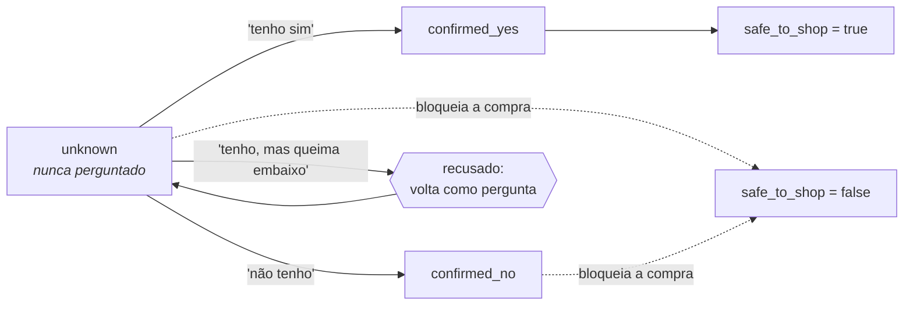
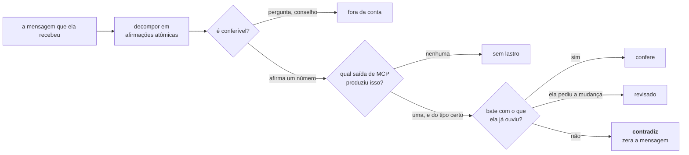

# Jacquinho, seu Sous-chef


Um sous-chef de IA para a **Dona Maria**, cozinheira que está abrindo o primeiro
delivery dela, o *Sabor da Maria*. Ela sabe cozinhar. O que ela não sabe é quais
pratos a despensa dela consegue produzir, se a cozinha dela dá conta de
fazê-los, e quanto cobrar para o delivery valer a pena.

Sous-chef, e não chefe: **quem decide o prato, o preço e a compra é ela.** Ele lê
a despensa, pergunta o que não sabe, faz as contas e abre os números.

E é construído de modo que **todo número que ele diz veio de uma chamada de
ferramenta, nunca da memória do modelo**.

> *O nome é uma homenagem ao chef **Érick Jacquin**, e o sotaque francês
> acaba aí: o Jacquinho fala português claro e não grita com ninguém.*

## Índice

- [Começando](#começando)
- [Uma consultoria que deu certo](#uma-consultoria-que-deu-certo)
- [Uma conversa que deu errado](#uma-conversa-que-deu-errado)
- [As decisões que sustentam isso](#as-decisões-que-sustentam-isso)
- [Onde cada exigência do desafio foi cumprida](#onde-cada-exigência-do-desafio-foi-cumprida)
- [O que eu não fiz, e por quê](#o-que-eu-não-fiz-e-por-quê)
- [Documentação](#documentação)

---

## Começando

```bash
./bin/jacquinho install     # cria o link em ~/.local/bin
jacquinho login             # autoriza com a conta Anthropic Pro
jacquinho                   # abre o chat
```

A credencial é a de uma conta Anthropic no plano **Pro**, autorizada por OAuth.
Não há chave de API porque o plano Pro não emite uma. Outros provedores têm bloco
pronto em `dockerfile/hermes-config.yaml`.

Comandos úteis: `jacquinho status`, `jacquinho tools`, `jacquinho confidence`
(acompanha ao vivo o quanto ele confia no que vai dizer), `jacquinho test`,
`jacquinho reset`. O passo a passo completo, os modos de falha e as linhas de log
que valem `grep` estão em **[docs/operacao.md](docs/operacao.md)**.

---

## Uma consultoria que deu certo

Transcrição real, bancos zerados, **sem cortes e sem edição**. É o caso que o
desafio pede: ela quer um prato que exige forno, não tem forno, e ele descobre
isso **antes** de ela gastar um centavo.

```
Dona Maria ▸ oi! quero fazer lasanha ao forno pra vender de marmita

Jacquinho  ▸ Lasanha à bolonhesa ao forno é uma ótima pedida pra marmita!
             Antes de eu olhar a receita direitinho e ver as contas, preciso
             saber uma coisa: você tem forno em casa? Ele assa por igual, sem
             deixar parte crua e parte queimada?

Dona Maria ▸ nao tenho forno nao, so um cooktop de 4 bocas. topo a de panela,
             tenho cacarola grande, so refogo, faco molho branco de olho,
             rende 8 marmitas. me diz o custo aberto e por quanto vender

Jacquinho  ▸ Oi, Dona Maria!
             Lasanha à bolonhesa ao forno tá fora, viu — porque você não tem
             forno, só o cooktop de 4 bocas. Mas dá pra fazer sua lasanha na
             panela mesmo: monta em camadas com o molho bolonhês e o molho
             branco de olho, tampa a caçarola grande e cozinha no fogo baixo.
             Fica com o mesmo gostinho, só muda o jeito de cozinhar.
             Fechei a conta do custo. Cada marmita fica em R$ 7,53 pra você
             fazer. As três que mais pesam: 80g de carne moída (R$ 2,24), 50g
             de mussarela (R$ 2,00) e o tomate (R$ 0,67). Depois vem a massa
             que você vai comprar (R$ 0,64) e o resto dos temperos e do molho
             branco fechando a conta.
             Pra fazer a fornada de 8 marmitas, você vai gastar uns R$ 29,24
             comprando massa de lasanha, orégano, manjericão e pimenta-do-reino
             — o resto você já tem em casa. Isso cabe tranquilo no seu
             orçamento, sobrando R$ 50,76 pra próxima fornada.
             Abaixo de R$ 8,37 por marmita você paga pra vender, então esse é o
             seu piso.
             Marmita parecida está saindo entre R$ 14,98 e R$ 28,00 por aí —
             achei poucas referências de preço, então trate isso como
             indicativo, não como faixa fechada de mercado. Com esses números:
             vendendo a R$ 15,90 → sobram R$ 6,78 por marmita pra você
             vendendo a R$ 23,90 → sobram R$ 13,98 por marmita
             vendendo a R$ 28,90 → sobram R$ 18,48 por marmita
             Qual desses preços você quer colocar, ou prefere outro valor?
```

### A conta é aberta, e por isso pode ser conferida

Repare no que ele **não** faz: dar um total e pedir fé. Cada linha da conta sai
com a gramatura e o preço, ordenada pela que mais pesa, porque as duas ou três
primeiras explicam quase todo o número e os centavos do fim são ruído.

Ela compra carne, sabe quanto pagou pelo quilo, e reconhece o R$ 2,24. Se algum
item estiver errado, é assim que ela descobre, e descobrir agora é melhor que
descobrir vendendo.

O custo unitário vem do cruzamento das duas abas da planilha dela
(`preço pago ÷ quantidade comprada`), e a conta bate ao centavo:

| Ingrediente | Por marmita | Custo unitário | Custo |
|---|---:|---:|---:|
| Carne moída (patinho) | 80 g | R$ 28,00/kg | R$ 2,24 |
| Queijo mussarela | 50 g | R$ 40,00/kg | R$ 2,00 |
| Tomate | ~84 g | R$ 8,00/kg | R$ 0,67 |
| Massa de lasanha *(compra)* | fração do pacote | pesquisado | R$ 0,64 |
| *…e o resto do molho e dos temperos* | | | R$ 1,98 |
| | | **por marmita** | **R$ 7,53** |

E **nenhuma sigla**: "cada marmita fica em R$ 7,53 pra você fazer", "abaixo de
R$ 8,37 você paga pra vender". Ela é cozinheira, não consultora. Decisão
[50](docs/decisoes.md#50-a-conta-é-aberta-em-português-e-a-divisão-é-da-ferramenta).

Quando a receita da web vem em porções, como *"1 kg de carne, serve 6"*, quem divide
é a ferramenta, não o modelo de cabeça. A gramatura da receita é o que determina
o valor por porção, e o que falta comprar é estimado sobre a mesma base: a
**fração** que a fornada consome entra no custo, a **embalagem inteira** entra na
lista de compras.

O resto confere: piso `7,53 / 0,90 = 8,37`, `15,90 × 0,90 − 7,53 = 6,78`,
`23,90 × 0,90 − 7,53 = 13,98`, `28,90 × 0,90 − 7,53 = 18,48`,
`80,00 − 29,24 = 50,76`.

**E o servidor confere sozinho.** A mensagem foi julgada na fronteira do turno,
afirmação por afirmação:

```
jacquinho.claims {"score":1.0,"verdict":"tudo confere","verifiable":16,"grounded":16,"contradictions":0}
```

Dezesseis afirmações, cada uma ligada ao campo de saída do MCP que a produziu.
Abrir a conta multiplicou o que pode ser **conferido**, em vez de multiplicar o
que precisa ser acreditado.

O estado que ficou nos bancos, consultável com `psql`:

```
recipe_costing  lasanha de panela | receita fechada, 8 porções | custo 7.53
                compras: R$ 29.24
recipe_blocks   lasanha ao forno | forno | ativo  ← volta no dia em que ela tiver um
```

Repare na última linha: o que fica arquivado é a **lasanha ao forno**, o prato
que morreu, e não a de panela que a substituiu.

## Uma conversa que deu errado

Vale mais que a de cima, porque mostra onde o sistema ainda falha. Gravada do
mesmo jeito, no mesmo build.

```
Dona Maria ▸ quero vender pudim de leite condensado, minha amiga disse que
             vende muito

Jacquinho  ▸ Pudim de leite condensado é uma boa pedida mesmo, sai bem em
             delivery.
             Dei uma olhada: leite, ovos e açúcar você já tem na despensa. Só
             falta o leite condensado, que não está na sua lista — mas isso é
             fácil, já deixo separado no orçamento quando chegar a hora. ← ERRADO
             Antes de fechar o prato, preciso entender sua cozinha. Me conta:
             você tem forno, e ele assa bem, por igual?

Dona Maria ▸ meu forno acende mas nao esquenta direito, as vezes queima embaixo

Jacquinho  ▸ Pudim de leite condensado do jeito tradicional não vai dar, porque
             seu forno não esquenta por igual e ainda queima embaixo — ia
             arriscar o pudim assado.
             Mas dá pra fazer pudim de panela: você cozinha ele em banho-maria
             direto no fogão, numa panela com tampa, sem precisar do forno.
             Você topa fazer esse, o de panela? E me conta: seu fogão dá conta
             de manter fogo baixo por bastante tempo sem apagar?

Dona Maria ▸ e ai, da pra fazer ou nao?

Jacquinho  ▸ Pudim de panela dá pra fazer sim, só falta eu confirmar uma coisa
             antes de fechar: seu fogão consegue manter fogo baixo por bastante
             tempo sem apagar?                                        ← ERRADO
```

**Dois erros, e nenhum deles é de conta.**

O primeiro é de ordem: ele oferece guardar dinheiro no orçamento **antes** de
saber se ela consegue fazer o prato. Não chega a reservar nada, e o portão
impediria se tentasse, mas prometer a compra antes da viabilidade é exatamente a
sequência que o desafio manda evitar.

O segundo é de condução: ela pergunta *"dá pra fazer ou não?"* e recebe de volta
a mesma pergunta do turno anterior. Ela não tinha respondido, então não é o caso
de perguntar duas vezes o que ela já disse, mas do lado dela é uma parede.

**O que funcionou, e é o motivo de a conversa não ter virado prejuízo.** O
*"acende mas não esquenta direito"* não virou um sim: um sim com hesitação dentro
é recusado, e o forno ficou `confirmed_no`. O prato morto foi fechado em voz
alta, com o motivo, e a fronteira do turno confirmou a entrega:

```
jacquinho.verdict {"dish":"pudim de leite condensado","delivered":true,"kind":"ruled_out"}
```

Se aquela mensagem **não** tivesse contado a ela, a dívida reabriria e o turno
seguinte começaria com todas as ferramentas de seguir em frente recusadas. É a
garantia que este projeto consegue dar, dita sem exagero: **não dá para desdizer
um turno ruim; dá para recusar esquecê-lo.**

Outras conversas, com o diagnóstico de cada falha, estão em
**[docs/dialogos.md](docs/dialogos.md)**.

## As decisões que sustentam isso

As cinquenta e duas decisões de arquitetura, cada uma com motivo e
consequência, estão em **[docs/decisoes.md](docs/decisoes.md)**. Estas seis são
as que respondem o desafio.

### Ferramentas MCP, e nenhuma skill

**O que dá para conferir vira ferramenta; o que só pode ser dito continua texto.**

Uma skill é instrução: texto que o modelo lê e, se tudo correr bem, segue. Uma
ferramenta é execução: código que roda e devolve um valor que o modelo não
produziu. A diferença aparece exatamente onde este trabalho não pode falhar,
porque ela vai gastar dinheiro em cima da resposta.

|  | Skill | Ferramenta MCP |
|---|---|---|
| "sempre calcule o CMV" | o modelo escreve um número plausível | `pricing_calculate_cmv` multiplica e devolve `0,20 × 14,00 = 2,80` |
| "não deixe ela comprar sem checar a cozinha" | um pedido educado | `budget_reserve_purchase` é **recusado** até o portão aprovar |
| "diga o quanto você confia" | o modelo estima | o middleware pontua a evidência sem ninguém pedir |

O caso extremo é o preço: sem uma faixa de mercado observada, `price_scenarios`
**não devolve preço de venda nenhum**, por mais que se peça. Uma skill só
conseguiria pedir isso educadamente.

O outro lado, dito por justiça: ferramenta custa esquema, validação e caminho de
erro para cada argumento; skill custa um parágrafo. Para comportamento sem certo
e errado computável, a ferramenta é peso morto. É por isso que a **voz** mora em
texto, e não em ferramenta. Decisões [3](docs/decisoes.md#3-o-procedimento-vai-com-o-servidor-a-voz-não-pode)
e [4](docs/decisoes.md#4-ferramentas-mcp-em-vez-de-skills).

### O que ela tem é estado, e muda quando ela muda de ideia

Toda capacidade da cozinha tem **três estados**, e só um deles é sim:



`unknown` é uma pergunta, nunca um sim. Um "sim" hesitante também não é sim: um
forno que ela tem *"mas queima embaixo"* volta como pergunta, porque o detalhe
que a desqualifica ficaria na nota, e a nota é o único lugar que o portão não lê.

E um "não" nunca é definitivo. Quando um prato cai por falta de equipamento, ele
é **arquivado contra aquele equipamento**, não descartado:

```
ela não tem forno  →  lasanha ao forno bloqueada por 'forno'
                      parmegiana bloqueada por gosto
ela ganha um forno →  a lasanha volta sozinha, e ela é avisada
                      a parmegiana continua fora: gosto não é problema
                      esperando solução
```

A volta não depende de o modelo lembrar: gravar o `confirmed_yes` levanta os
bloqueios daquele item na mesma chamada. Se a receita de um prato aceito mudar
porque **ela** pediu, tudo que pendurava nela é refeito: buscar a receita, rodar
o portão, recalcular custo e preço. Decisões
[7](docs/decisoes.md#7-capacidades-têm-três-estados-e-silêncio-não-é-consentimento),
[30](docs/decisoes.md#30-o-prato-morto-é-fechado-pela-ferramenta-não-pelo-lembrete),
[49](docs/decisoes.md#49-o-prato-arquivado-é-o-que-morreu-não-o-que-sobrou),
[35](docs/decisoes.md#35-um-sim-com-mas-dentro-não-é-um-sim) e
[43](docs/decisoes.md#43-a-receita-de-um-prato-fecha-uma-vez).

### O estoque dela é finito, e baixa quando ela aceita o prato

Ela tem **1,5 kg** de patinho. Não patinho à vontade. Se o segundo prato calcula
em cima da geladeira que o primeiro já esvaziou, a lista de compras sai curta — e
ela chega na cozinha com metade da carne que a fornada pede.

Então o estoque deixou de ser um número lido da planilha e virou uma
**subtração**: o que a planilha semeou, menos o que os pratos já aceitos
consumiram. O consumo mora numa tabela só-adição, uma linha por ingrediente por
prato.

Numa conversa gravada com os bancos zerados, ela pôs dois pratos no cardápio e a
segunda fornada bateu no fim da carne:

```
Dona Maria ▸ pensando melhor, essa bolonhesa eu quero fazer 18 marmitas, que o
             pedido do fim de semana é grande

Jacquinho  ▸ Só um aviso antes: você tinha 1,5 kg de carne moída; o
             escondidinho levou 500 g, sobrou 1 kg. Pra 18 marmitas a
             bolonhesa pede 1,5 kg, então faltam 500 g pra comprar.
```

Os dois pratos somam os 2 kg que as fornadas pedem contra os 1,5 kg que ela
tinha, e o meio quilo que falta virou compra a R$ 14,00 — o preço por quilo que
ela mesma pagou. A conversa inteira está em
[docs/dialogos.md](docs/dialogos.md#certo-5--os-2-kg-de-patinho-e-o-meio-quilo-que-falta).

Duas escolhas fazem essa frase existir. **Só-adição**, porque um `UPDATE` no
estoque guarda o saldo e joga fora o porquê — e o que ela precisa ouvir não é o
saldo, é para onde a carne foi; um "faltam 500 g" solto parece erro de planilha,
e o que ela faz com um erro de planilha é duvidar do número em vez de comprar a
carne. E **no aceite, não no cálculo**: orçar um prato é uma pergunta, colocá-lo
no cardápio é uma decisão. O mesmo prato é orçado várias vezes, inclusive quando
ela recusa; se cada orçamento baixasse o estoque, a despensa esvaziava por conta
de perguntas.

O caminho de volta é automático: tirar o prato do cardápio, ou reabrir a receita
porque ela mudou de ideia, devolve o que aquele prato tinha levado.

Aqui está a vantagem prática do Postgres, e é bem concreta: o estoque dela é um
dado que o operador precisa poder mexer — repor o que ela comprou, corrigir o que
a planilha trouxe errado, montar um cenário. Isso é um `UPDATE` de uma linha,
conferível na hora com um `SELECT`. Guardado junto do estado de conversa, seria
um blob que só o código sabe abrir. Decisão
[51](docs/decisoes.md#51-o-estoque-dela-é-finito-e-baixa-quando-o-prato-entra-no-cardápio).

### Confiança por afirmação atômica, tipada pela saída do MCP

Uma nota por mensagem não diz nada: uma mensagem tem várias afirmações e elas não
têm o mesmo lastro. Toda mensagem entregue é decomposta e cada afirmação é
julgada sozinha:



Três escolhas fazem isso funcionar:

**A identidade da afirmação vem da saída de MCP que a produziu**, não das
palavras ao redor do número. Um mapa declarativo liga cada campo de saída a um
tipo: `pricing_calculate_cmv.cmv_per_portion` é custo,
`menu_add_dish.price` é preço, `market_research_dish_prices.reference.median` é
mercado. Ler o tipo da frase é tentador e errado: *"sobram R$ 63,91 dos seus
R$ 80"* é orçamento, e todas as pistas que o classificariam como lucro estão ali.

**Saída, nunca argumento.** Uma ferramenta é evidência do que **calcula**. O que
ela recebe é o modelo conversando consigo mesmo, e contar isso fecha um círculo
com nada dentro. Os números que chegaram como argumento são subtraídos, em toda
chamada.

**Lastro não é compromisso.** `price_scenarios` devolve três preços: são
candidatos, e nenhum é o preço do prato. Só o que foi para o cardápio compromete.
Um valor só vira promessa quando **chega até ela**, e uma contradição com o que
ela já ouviu **zera** a mensagem, sem média: ouvir dois custos diferentes para o
mesmo prato não é oitenta por cento certo.

Os tipos são modelos Pydantic e o pipeline é determinístico, então roda em toda
mensagem sem custar uma chamada de modelo. O método, com as referências
científicas que o embasam, está em
[docs/metricas.md](docs/metricas.md#afirmações-atômicas-o-pipeline-por-mensagem);
as decisões, em [45](docs/decisoes.md#45-a-confiança-de-uma-mensagem-é-a-soma-das-afirmações-dela)
e [47](docs/decisoes.md#47-as-afirmações-são-conferidas-contra-a-saída-do-mcp-que-as-produziu).

### Redis para a conversa, Postgres para o que ela decidiu

O agente recebe sempre os **20 últimos turnos mais um resumo** de tudo antes
deles. O custo em tokens por turno fica limitado por construção, e os turnos
antigos continuam gravados: o corte é do que o agente segura, não do que se
guarda. O resumo é reescrito pelo próprio agente quando 20 turnos novos se
acumulam, sem um segundo modelo no circuito.

Isso é o que é **quente**, e vive no Redis. O que a conversa **decidiu** vive no
Postgres, e a régua que separa os dois é simples: vai para o Redis quando perdê-lo
custa contexto; vai para o Postgres quando perdê-lo custa uma pergunta repetida
ou dinheiro gasto duas vezes.

Três razões pelas quais o perfil da cozinha não podia ficar na conversa. Um
bloqueio é uma **relação**, não um valor: a lasanha saiu *por causa do* forno, e
quando o forno aparece os pratos voltam com um `UPDATE ... WHERE blocking_item =
'forno' RETURNING`. A janela de 20 turnos **descarta**, e um perfil descartado
faz a próxima consultoria recomeçar perguntando tudo. E *"o que ela ainda não
respondeu"* é uma **consulta**, não uma dedução: `unknown` é um estado guardado.

Decisões [18](docs/decisoes.md#18-o-redis-guarda-a-conversa-20-turnos-mais-1-resumo)
e [19](docs/decisoes.md#19-o-postgres-guarda-os-dados-da-dona-maria). O esquema
inteiro está em [docs/modelo-de-dados.md](docs/modelo-de-dados.md).

### A voz mora no `SOUL.md`, porque não pode morar em outro lugar

O Hermes trata texto vindo de um servidor MCP como **dado não confiável**, com
um scanner de injeção sobre ele, e não injeta as `instructions` do servidor no
system prompt. Persona escrita ali simplesmente não chega ao modelo.

Por isso `hermes/SOUL.md` existe, e por isso ele contém **só** o que não pode ser
verificado: idioma, quem fala primeiro, postura, e as regras de voz que nenhuma
ferramenta consegue impor. A ideia central que o organiza:

> **Ela contratou um sous-chef, não um relatório.** Ele fala *com* ela, não
> *sobre* ela. Não narra a própria busca, não menciona ferramenta, não devolve a
> pergunta que a despensa já responde, e nunca pergunta duas vezes o que ela já
> respondeu.

Uma regra de voz, porém, tinha como ser medida — e por isso foi. Ela lê no
celular com a panela no fogo: receita, custo, compras, mercado e preço soldados
num parágrafo é um parágrafo que ela passa o olho, e o que estava no meio se
perde, em geral a pergunta. Então a resposta vai **em partes**, uma por linha, com
a pergunta sozinha na última. O que se mede é empilhamento, não comprimento — uma
resposta longa para uma pergunta grande é uma boa resposta. `message_pacing`
volta em `confidence_assess_answer` dizendo em quantas partes o rascunho está e
onde é a costura, sem nunca reescrever nada: prosa quebrada por regra soa
quebrada, e o agente já sabe onde os próprios parágrafos terminam. Decisão
[52](docs/decisoes.md#52-a-mensagem-vai-em-partes-e-o-tamanho-não-é-o-problema).

O procedimento (que ferramenta chamar, em que ordem, o que exige o quê) **não**
está lá. Está nas descrições das ferramentas e no `next_step` de cada resultado,
onde existe verificação. Decisão [3](docs/decisoes.md#3-o-procedimento-vai-com-o-servidor-a-voz-não-pode).

---

## Onde cada exigência do desafio foi cumprida

O enunciado chama o custo de **CMV**, e esta tabela usa o termo dele. Na conversa
com a Dona Maria a sigla nunca aparece: lá é "cada marmita custa R$ 7,53 pra você
fazer".

| Enunciado | O que ele pede | Onde vive no código |
|---|---|---|
| **2.1** | Pesquisar receitas reais na internet | `recipes_search_recipes`, `dishes_discover_dishes` |
| **2.1** | Apresentar candidatas e pedir feedback dela | `menu_record_feedback` |
| **2.2** | Utensílios, equipamentos, técnicas, restrições | catálogo de 26 itens, `kitchen_next_questions` |
| **2.2** | **Não deixar comprar e descobrir depois** | `kitchen_elicitation_gaps`, `safe_to_shop` |
| **2.3** | O que ela já tem, e em que quantidade | `recipes_check_pantry_coverage`, `pantry_what_is_left` (o estoque baixa a cada prato aceito) |
| **2.3** | O que falta comprar, o custo, e se cabe | `pricing_calculate_cmv`, `budget_check_purchase` |
| **2.4** | CMV = Σ (quantidade usada × custo unitário) | `pricing_calculate_cmv`, aritmética em Python |
| **2.4** | Custo unitário = preço pago ÷ quantidade comprada | `PantrySheet`, `UnitConverter` |
| **2.4** | Incluir compras complementares no CMV | `researched_prices`, pela fração usada |
| **2.4** | Ela recebe `0,90 × P`; piso `P ≥ CMV / 0,90` | `net_share`, `break_even` |
| **2.4** | Lucro `0,90 × P − CMV` | `profit` |
| **2.4** | **2–3 cenários, e ela decide** | `pricing_price_scenarios` |
| **3** | Orçamento de R$ 80,00 para complementos | `budget_reserve_purchase` |

Três coisas fora do enunciado, que a conversa mostrou serem necessárias: dizer
**o quanto confia** no que está falando, fechar com **o resultado da fornada**,
que é a pergunta que ela de fato faz, e tratar a quantidade em estoque como
**finita** — o enunciado dá a coluna, e um segundo prato que ignora o que o
primeiro comeu manda ela para a cozinha com metade da carne.

As **cinco escolhas** que o enunciado deixou a meu critério (modelo, context
files, tools/MCP, estrutura de memória, skills) estão respondidas uma a uma em
[docs/decisoes.md](docs/decisoes.md#as-cinco-escolhas-que-o-enunciado-deixou-em-aberto).

---

## O que eu não fiz, e por quê

Escopo cortado de propósito. O motivo importa mais que o item.

**Nenhum cálculo passa por modelo.** CMV, preço mínimo, lucro, saldo e projeção
de inflação são Python. Um modelo a quem se pede para multiplicar preços devolve
um número plausível, e plausível é indistinguível de correto até alguém gastar
dinheiro em cima.

**Não persisti a conversa entre sessões, só o que ela decidiu.** Reconstituir o
diálogo de semanas atrás não ajuda ninguém; saber que ela não tem forno, sim.

**Não construí memória vetorial nem RAG.** A despensa tem 37 linhas. Busca
semântica sobre isso é infraestrutura para um problema que `SELECT` resolve, e
traz uma classe de erro nova: recuperar o ingrediente parecido em vez do certo.

**Não coloquei um segundo modelo como juiz.** O enunciado pede um agente, e dois
provedores no circuito é uma dependência e uma conta a mais.

**Não calibrei os limiares de confiança.** Calibrar exige registrar desfecho (o
prato foi aceito? o preço se sustentou?) e não há esse dado. A nota **ordena**
respostas; não mede probabilidade de nada, e isso está escrito onde alguém possa
tropeçar nela.

**Não isolei sessões simultâneas de verdade.** Correto para uma consultoria por
vez, que é o caso de uso; insuficiente para várias pessoas ao mesmo tempo.

**Não usei um plugin em Python do Hermes.** Ele poderia reescrever a mensagem que
está saindo. Um servidor escrevendo direto para a Dona Maria é uma garantia pior
que a de recusar esquecer.

**Não fiz teste automatizado de diálogo.** Cada execução custa uma chamada de
modelo e o julgamento do resultado é humano. A simulação é manual, e o que ela
achou está em [docs/dialogos.md](docs/dialogos.md), inclusive o que continua
torto.

---

## Documentação

| Documento | Conteúdo |
|---|---|
| [docs/arquitetura.md](docs/arquitetura.md) | Componentes, camadas, fluxogramas e diagramas de sequência |
| [docs/decisoes.md](docs/decisoes.md) | As 52 decisões de arquitetura, com motivo e consequência |
| [docs/dialogos.md](docs/dialogos.md) | Nove conversas reais: cinco que deram certo, quatro que deram errado |
| [docs/metricas.md](docs/metricas.md) | Como a confiança é calculada, o pipeline de afirmações, e as referências |
| [docs/modelo-de-dados.md](docs/modelo-de-dados.md) | Esquema do Postgres, chaves do Redis, normalização de unidades |
| [docs/referencia-mcp.md](docs/referencia-mcp.md) | As 59 ferramentas, os prompts e os recursos |
| [docs/operacao.md](docs/operacao.md) | Execução, credenciais, depuração, modos de falha |
| [docs/testes.md](docs/testes.md) | A suíte automatizada e o que cada rodada de simulação achou |

### Estrutura

```
bin/jacquinho          ponto de entrada de linha de comando
app/domain/            cálculo e regras, sem conhecer MCP
app/mcps/              uma classe por servidor MCP, mais a raiz de composição
hooks/                 fronteiras de turno: a fala dela, a resposta dela
hermes/SOUL.md         voz e quem fala primeiro, lido pelo agente
dockerfile/            imagem, compose, dependências, config do agente
```
