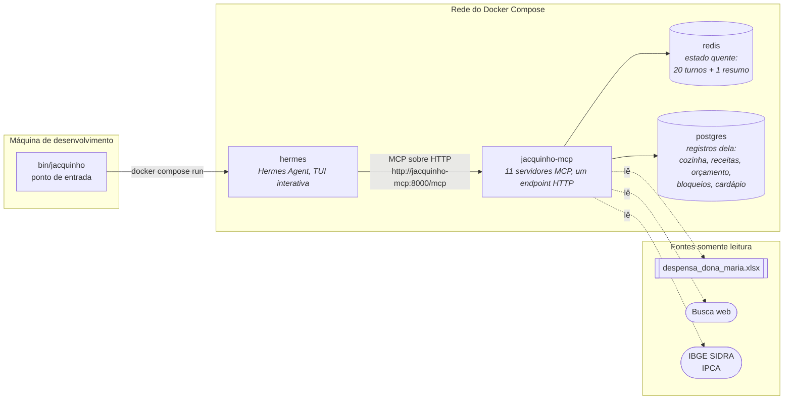
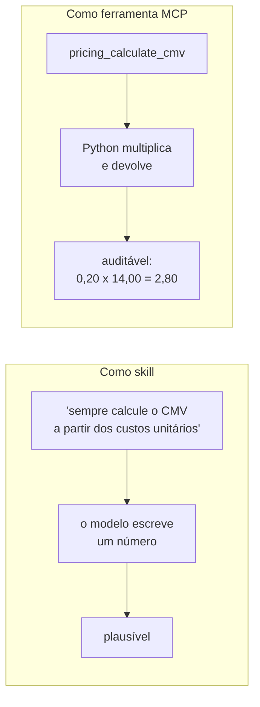
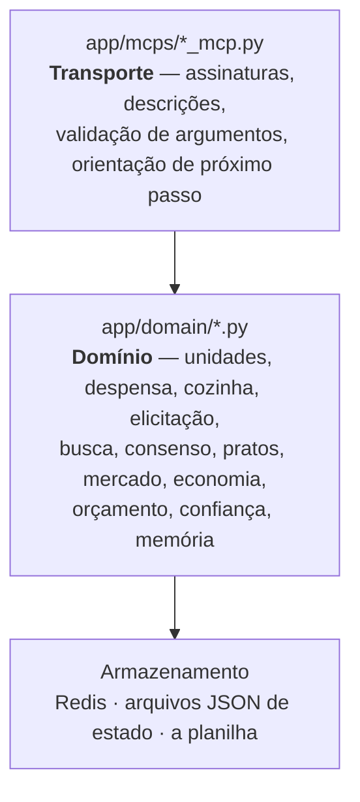
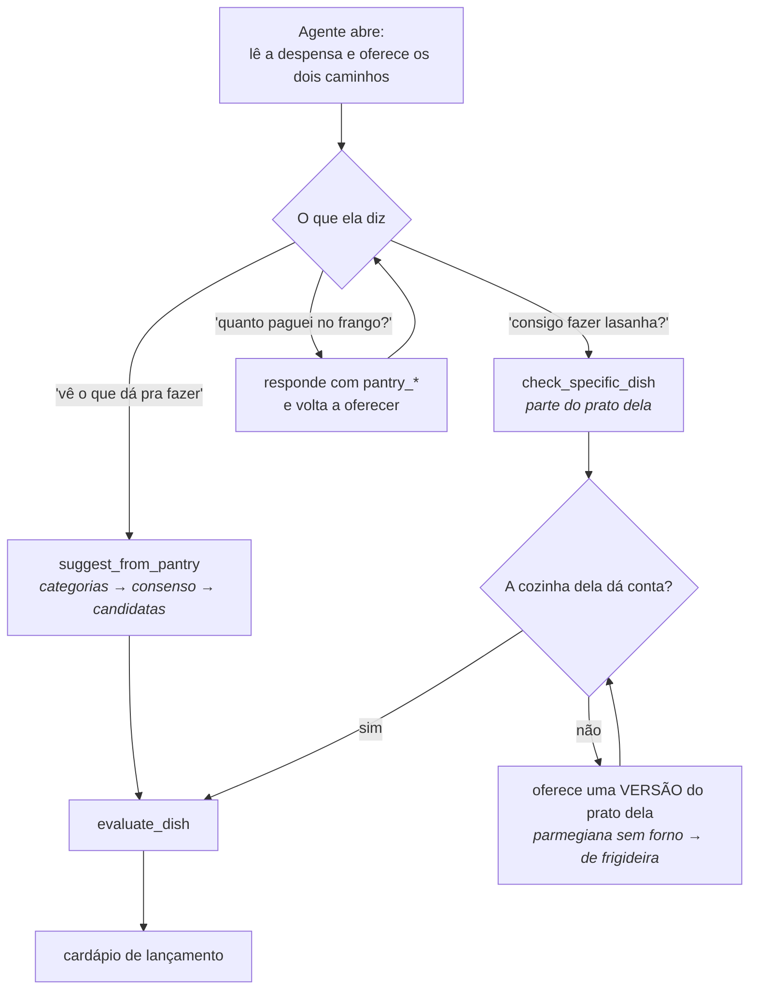
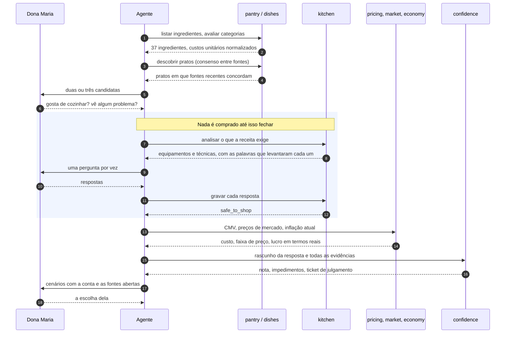
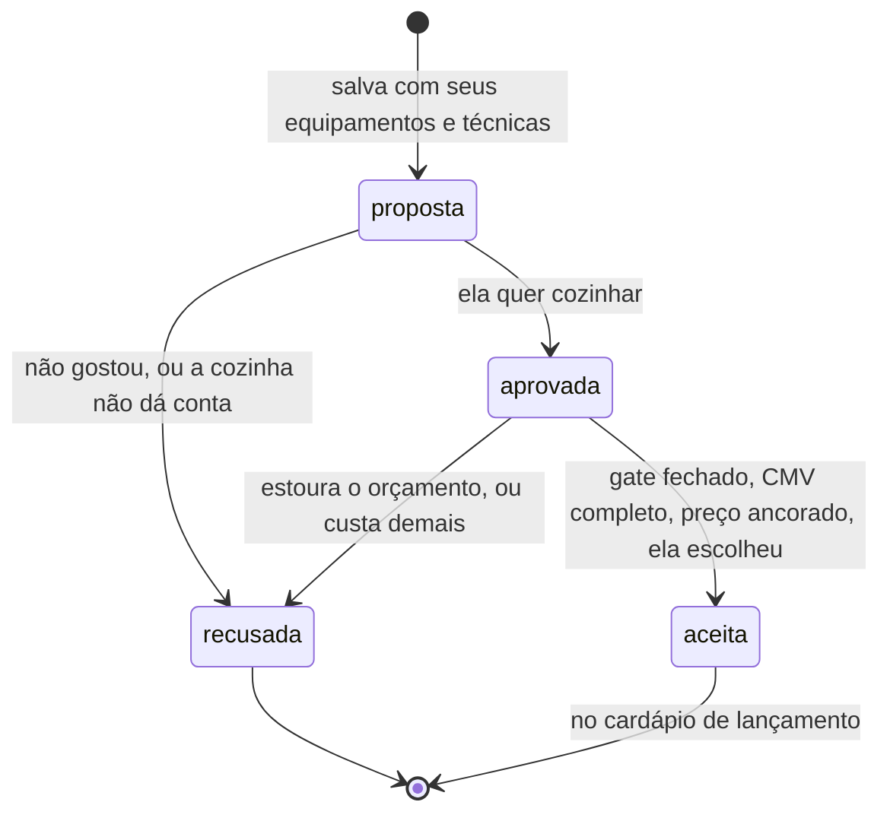
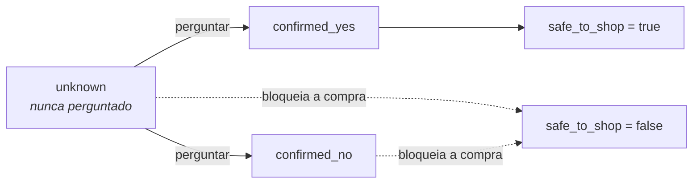
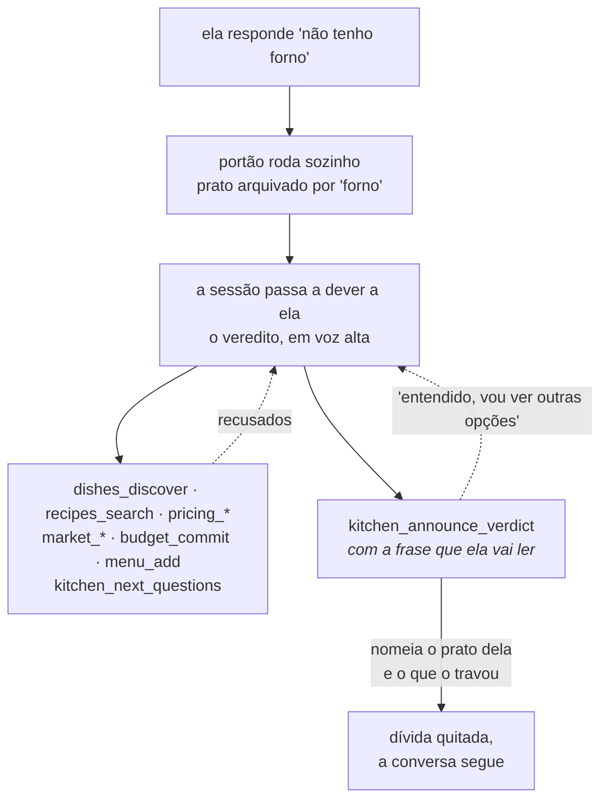

# Sabor da Maria


Uma consultora de cardápio e precificação para a **Dona Maria**, cozinheira que
está abrindo o primeiro delivery dela. Ela sabe cozinhar. O que ela não sabe é
quais pratos a despensa dela consegue produzir, se a cozinha dela dá conta de
fazê-los, e quanto cobrar para o delivery valer a pena.

O agente a acompanha de uma planilha de compras até um cardápio de lançamento
precificado, e é construído de modo que **todo número que ele diz veio de uma
chamada de ferramenta, nunca da memória do modelo**.

---

## O caso que prova o requisito central

A Dona Maria quer um prato que exige forno. Ela não tem forno. O agente
descobre isso **antes** de ela gastar um centavo do orçamento — e depois, quando
ela ganha um forno, o prato volta sozinho.

Transcrição real, bancos zerados, gravada com `jacquinho`:

```
Dona Maria ▸ oi! quero fazer lasanha ao forno pra vender de marmita

Jacquinho  ▸ Que legal! Lasanha de carne moída ao forno é sucesso garantido
             em marmita. Antes de eu montar tudo pra você, preciso confirmar
             algumas coisas da sua cozinha. Primeira: você tem forno em casa?
             Funciona bem, assa por igual?

Dona Maria ▸ nao tenho forno nao, so um cooktop de 4 bocas

Jacquinho  ▸ Sua lasanha de carne moída ao forno não vai dar certo, porque
             você não tem forno, só o cooktop de 4 bocas. Mas dá pra fazer a
             versão dela na panela, no fogão: lasanha de panela, montando as
             camadas de massa, molho e queijo direto na panela, no fogo baixo,
             até derreter tudo. Fica com o mesmo gostinho, só muda o jeito de
             cozinhar. Topa fazer assim?

Dona Maria ▸ ah espera, esqueci de falar: minha filha me deu um forno eletrico
             semana passada, ta na caixa ainda mas funciona

Jacquinho  ▸ Boa notícia: com esse forno elétrico que sua filha te deu, a
             lasanha de carne moída ao forno volta pro jogo! Era só isso que
             estava faltando antes. Bora fazer ela do jeito que você pensou,
             assada mesmo?
```

Três coisas acontecem aí, e nenhuma delas depende de o modelo lembrar.

**Ele pergunta em vez de supor.** A primeira mensagem não recebeu uma receita
pronta: recebeu uma pergunta. Um `confirmed_yes` é uma afirmação sobre algo que
ela disse, e `kitchen_record_capability` procura as palavras dela na conversa
guardada antes de aceitar. Sem a fala dela no registro, a resposta é recusada e
o item continua `unknown` — que é uma pergunta, nunca um sim.

**Ele fecha o prato dela em voz alta.** No instante em que ela diz "não tenho
forno", o servidor roda o portão, arquiva a lasanha como bloqueada *pelo forno*,
e passa a dever a ela essa frase. Enquanto a dívida existe, tudo que significa
seguir em frente — buscar outro prato, calcular custo, precificar, fazer a
próxima pergunta — é **recusado**. Ela só volta a ouvir sobre outra coisa depois
de ouvir sobre a dela.

**E a resposta dela não é definitiva.** O bloqueio guardou *o que* o causou, e
por isso pode se desfazer: ela diz que ganhou um forno, o bloqueio se levanta
sozinho e a lasanha volta — com a mesma dívida de contar isso a ela.

O que aconteceu por baixo, em ordem:

```
turno 1  chat_save_turn                       guarda a fala dela, literal
         recipes_search_recipes
         kitchen_analyse_recipe_requirements  lê 'leve ao forno' no texto
         kitchen_check_feasibility            forno = unknown → pergunta

turno 2  kitchen_record_capability            forno = confirmed_no
                                              └─ com as palavras dela, conferidas
         → prato arquivado: missing_equipment/forno
         → dívida aberta; ferramentas de seguir em frente recusadas
         kitchen_announce_verdict             a frase, checada e entregue

turno 3  kitchen_record_capability            forno = confirmed_yes
         recipes_revisit_blocks               bloqueio levantado
         kitchen_announce_verdict             a volta, contada a ela
```

E o estado no banco, ao fim:

```
perfil ......... forno=confirmed_yes  ("forno elétrico, ainda na caixa")
                 fogao=confirmed_yes  ("cooktop de 4 bocas")
bloqueio ....... lasanha … ao forno | forno | ativo=false
                 levantado porque: "forno elétrico, ainda na caixa, mas funciona"
orçamento ...... R$ 80,00 de R$ 80,00 — nenhum centavo saiu
cardápio ....... 0 pratos
```

A exigência de forno não veio de o modelo lembrar que lasanha vai ao forno: veio
de `kitchen_analyse_recipe_requirements` ler as palavras `leve ao forno` no texto
da receita que ele mesmo buscou. E a frase que ela ouviu não veio de um pedido
educado numa descrição de ferramenta: veio de uma dívida que fecha as portas
até ser paga.

O caminho até aqui está em [docs/testes.md](docs/testes.md) — incluindo as três
tentativas anteriores, todas por redação, todas fracassadas.

---

## Índice

- [O caso que prova o requisito central](#o-caso-que-prova-o-requisito-central)
- [O que ele faz](#o-que-ele-faz)
- [Arquitetura](#arquitetura)
- [Começando](#começando)
- [A consultoria](#a-consultoria)
- [Como a conversa começa](#como-a-conversa-começa)
- [Os onze servidores MCP](#os-onze-servidores-mcp)
- [Garantias](#garantias)
- [Configuração](#configuração)
- [Estrutura do projeto](#estrutura-do-projeto)
- [O que eu não fiz, e por quê](#o-que-eu-não-fiz-e-por-quê)
- [Documentação](#documentação)

---

## O que ele faz

| Etapa | O que acontece | Responsável |
|---|---|---|
| Ler a despensa | As duas abas da planilha cruzadas em custos unitários normalizados | `pantry` |
| Decidir o que é possível | Categorias de prato avaliadas contra os ingredientes reais | `dishes` |
| Achar receitas de verdade | Busca web com várias formulações, mantida só quando fontes independentes concordam | `dishes`, `recipes` |
| Perguntar antes de supor | Equipamentos, técnicas e limites de operação elicitados dela | `kitchen` |
| Calcular o custo | CMV a partir dos custos unitários, com um saldo de orçamento vivo | `pricing`, `budget` |
| Precificar | Ancorado em preços de mercado observados, expresso em moeda de hoje | `market`, `economy` |
| Conferir a resposta | Nota determinística das evidências mais um turno de julgamento | `confidence` |
| Entregar | O cardápio de lançamento, com a força da evidência de cada prato | `menu` |

---

## Arquitetura

Dois processos, um protocolo. O agente conduz a conversa; um único servidor MCP
guarda todo fato, regra e cálculo.



### Por que o cálculo vive fora do modelo

O agente decide *o que dizer*. Ele nunca decide *quanto é um número*. Custos
unitários, CMV, preço mínimo, cenários de preço, saldo de orçamento e projeções
de inflação são calculados em Python e devolvidos como dados. Um modelo de
linguagem a quem se pede para multiplicar preços de mercado produz um número
plausível, e a Dona Maria compraria mantimentos em cima dele.

### Por que um endpoint HTTP em vez de vários

Os onze servidores são classes separadas, com responsabilidades separadas,
compostas em uma única instância FastMCP e montadas sob prefixos (`pantry_`,
`pricing_`, `kitchen_`, …). Um só endpoint HTTP significa um container, um
healthcheck, uma URL na configuração do agente — e mesmo assim os servidores
continuam podendo ser entendidos, testados e substituídos um de cada vez.

HTTP em vez de stdio importa estruturalmente: um servidor stdio é um
subprocesso de quem o lança, então teria que morar dentro do container do
agente. Sobre HTTP a camada de cálculo é um serviço por direito próprio, e pode
ser exercitada sem sequer iniciar o agente.

### Por que ferramentas MCP, e não skills

O projeto não tem nenhuma skill. A regra é simples: **o que pode ser conferido
vira ferramenta; o que só pode ser dito continua texto.**

Uma skill é instrução — texto que o modelo lê e, se tudo correr bem, segue. Uma
ferramenta é execução — código que roda e devolve um valor que o modelo não
produziu. A diferença aparece exatamente onde este trabalho não pode falhar,
porque ela vai gastar dinheiro em cima da resposta.



O que isso compra:

| | Skill | Ferramenta MCP |
|---|---|---|
| Um número errado | Possível, e silencioso | O modelo não escreve o número |
| Recusar | Só consegue *pedir* que não se faça | Devolve `safe_to_shop: false` e **não entrega** o valor |
| Estado | Nenhum | Saldo que diminui, bloqueio que se desfaz, transação e `CHECK` |
| Testar | Só rodando conversa | Chamando função, sem modelo no meio |
| Observar | "Foi seguida?" não é um evento | Requisição HTTP com log: o quê, quando, com quais argumentos |
| Alcance | Presa ao agente | Serviço que qualquer cliente MCP usa, e que escala sozinho |

O caso extremo é o `price_scenarios`: sem uma faixa de mercado observada ele
**não devolve preço de venda nenhum**, por mais que se peça. Uma skill só
conseguiria pedir isso educadamente.

O outro lado, que também vale dizer: ferramenta custa esquema, validação e um
caminho de erro para cada argumento; skill custa um parágrafo. Para
comportamento sem certo e errado computável — voz, quem fala primeiro — a
ferramenta é peso morto, e o texto é a resposta certa. É por isso que a voz mora
em `hermes/SOUL.md` e não numa ferramenta.

### Camadas



A camada de domínio não conhece MCP. Pode ser importada e testada sem subir um
servidor, e a camada de ferramentas fica fina o bastante para ser lida como
documentação das obrigações do agente.

---

## Começando

```bash
./bin/jacquinho install     # cria o link em ~/.local/bin
jacquinho login             # autoriza com a conta Anthropic Pro
jacquinho                   # abre o chat
```

**A credencial usada é a de uma conta Anthropic no plano Pro.** Não há chave de
API: o plano Pro não emite uma. O `jacquinho login` autentica por OAuth contra a
mesma conta do `claude.ai` — ele imprime um link, você autoriza no navegador,
copia o código que aparece e cola de volta no terminal. O token fica no volume
`hermes-data` e o login é uma vez só. O passo a passo completo está em
[docs/operacao.md](docs/operacao.md#credenciais).

Outros caminhos, cada um com um bloco pronto em `dockerfile/hermes-config.yaml`:
chave de API em `dockerfile/.env`, camada gratuita do Google AI Studio ou do
OpenRouter, ou Ollama local sem conta nenhuma.

O modelo padrão é o **Claude Sonnet 5**, fixado em
`dockerfile/hermes-config.yaml`. A aritmética está em Python e as regras são
portões, então o agente não precisa de raciocínio profundo — mas precisa segurar
o fio de uma conversa longa com mais de cinquenta ferramentas, e é aí que o
modelo mais barato mostrou fraqueza. Condução é a parte difícil aqui, não
pensamento. `claude-haiku-4-5` é uma linha, se custo importar mais.

O agente roda em qualquer provedor que você apontar e alcança as 56 ferramentas
de qualquer jeito. O que ele exige de verdade não é inteligência bruta e sim
**chamada de ferramenta confiável**: são 56 ferramentas e cadeias de vários
passos. Cada caminho — assinatura, chave, camada gratuita, Ollama local — tem um
bloco pronto em `dockerfile/hermes-config.yaml`.

Um único modelo participa do circuito. O juiz da camada de confiança é um turno
separado e restrito desse mesmo modelo.

| Comando | Para quê |
|---|---|
| `jacquinho` | Sobe os serviços e abre o chat |
| `jacquinho up` | Sobe só o Redis e o servidor MCP |
| `jacquinho status` | O que está rodando e se está saudável |
| `jacquinho tools` | Lista todas as ferramentas que o agente alcança |
| `jacquinho logs [svc]` | Acompanha os logs |
| `jacquinho confidence` | Acompanha a confiança do que o agente vai dizer |
| `jacquinho test` | Roda a suíte de testes |
| `jacquinho down` | Para tudo |
| `jacquinho reset` | Zera a consultoria: Postgres, Redis e a transcrição do Hermes. Preserva o login e a planilha |
| `jacquinho login` | Autoriza com a conta Anthropic Pro, uma vez só |
| `jacquinho hermes …` | Repassa um comando direto para o CLI do agente |
| `jacquinho install` | Cria o link em `~/.local/bin` |

O `jacquinho` resolve o repositório através do próprio link simbólico, sobe o
Redis e o servidor MCP, espera o healthcheck e só então abre o chat. Todo start
reconstrói a imagem do MCP — cerca de cinco segundos com cache quente — para
que uma edição em `app/` nunca fique rodando contra uma imagem velha.

O servidor MCP é alcançável por conta própria, para depuração:

```bash
curl -s -X POST http://localhost:8000/mcp \
  -H 'Content-Type: application/json' \
  -H 'Accept: application/json, text/event-stream' \
  -d '{"jsonrpc":"2.0","id":1,"method":"initialize","params":{
       "protocolVersion":"2025-06-18","capabilities":{},
       "clientInfo":{"name":"curl","version":"1"}}}'
```

(descomente o bloco `ports:` em `dockerfile/docker-compose.yaml` antes)

---

## Como a conversa começa

O agente fala primeiro. Ela não sabe o que pedir ainda: lê a despensa, comenta em
duas linhas e abre as duas portas — *"quer que eu procure pratos que dão pra
fazer com isso, ou você já tem alguma ideia em mente?"*

A partir daí, o prompt `open_conversation` roteia o que ela disser. Os três
caminhos são igualmente válidos, porque uma pessoa real chega por qualquer um.



O caminho do meio tem uma regra própria: quando o prato dela trava, o agente
oferece **uma versão do prato dela** antes de propor outro. Ninguém gosta de
ouvir só "não dá".

Antes de qualquer coisa ele lê `chat_get_context` e
`kitchen_read_kitchen_profile`, porque uma conversa retomada não pode começar
perguntando de novo o que ela já respondeu.

---

## A consultoria



Quando um prato cai — ela não quer cozinhar aquilo, ou a cozinha dela não dá
conta — a recusa é registrada com o motivo e a próxima opção sai de uma lista
já guardada. Buscar na web de novo é o último recurso.



---

## Os onze servidores MCP

| Prefixo | Ferramentas | Responsabilidade |
|---|---:|---|
| `chat` | 7 | A conversa: janela de 20 turnos mais um resumo |
| `pantry` | 3 | A planilha como custos unitários normalizados |
| `dishes` | 6 | Categorias de prato e descoberta por concordância entre fontes |
| `recipes` | 10 | Montagem de buscas, cobertura da despensa e o catálogo de receitas |
| `kitchen` | 9 | Elicitação de restrições e o gate de viabilidade |
| `market` | 1 | Preços de delivery observados para pratos comparáveis |
| `economy` | 2 | Inflação regional, índice geral e alimentação no domicílio |
| `budget` | 4 | O orçamento de complementos como saldo gastável |
| `pricing` | 2 | CMV e cenários de preço ancorados no mercado |
| `confidence` | 2 | Quanto a evidência sustenta a resposta |
| `menu` | 6 | Prontidão para aceite, a opinião dela sobre cada prato, e o cardápio |

Mais quatro prompts — `open_conversation`, `check_specific_dish`,
`suggest_from_pantry` e `evaluate_dish` — que carregam o procedimento, e um
recurso, `pantry://ingredients`.

Assinaturas completas: [docs/referencia-mcp.md](docs/referencia-mcp.md).

---

## Garantias

Estas são impostas em código, não pedidas em prosa.

### Nunca se presume que ela tenha algo

O que uma receita exige é lido do texto daquela receita, e toda exigência é
confrontada com o que ela de fato respondeu. Três estados, e só um deles é sim:



#### Um "sim" é uma afirmação sobre o que ela disse

O erro mais caro que este agente já cometeu não foi de conta: foi decidir que
ela tinha um forno sobre o qual ninguém tinha perguntado. O portão aprovou em
cima disso e a lasanha inteira foi precificada — para uma cozinha que não a
assa. Nada no servidor podia contradizer aquilo, porque o único registro do que
ela tinha dito vivia no contexto do modelo.

Agora vive no Redis. `kitchen_record_capability` exige `her_words` para qualquer
`confirmed_yes` ou `confirmed_no`, e **procura essa frase nas falas dela** antes
de aceitar:

| Situação | Resposta do servidor |
|---|---|
| Sem `her_words` | Recusado: *"um confirmado é uma afirmação sobre o que ELA disse"* |
| `her_words` que ela não disse | Recusado, com quantas falas dela foram procuradas |
| Nenhuma fala guardada | Recusado: guarde a mensagem dela primeiro |
| `state='unknown'` | Aceito sem citação — `unknown` é uma pergunta, não uma afirmação |

O que fica gravado carrega a citação: `forno=confirmed_no — ela: "nao tenho
forno nao, so um cooktop de 4 bocas"`. Quem auditar depois lê a origem da
afirmação junto com ela.

#### O agente sabe o que ainda não perguntou

Isso não é dedução do modelo, é uma consulta. `unknown` é um estado guardado, e
por isso a lacuna é contável:

| Ferramenta | Devolve |
|---|---|
| `kitchen_elicitation_coverage` | `answered`, `still_unknown`, `coverage_percent`, `ready_to_recommend` |
| `kitchen_next_questions` | O que falta, ordenado por prioridade, com a pergunta pronta |
| `kitchen_elicitation_gaps` | Para um prato: o que perguntar antes de comprar |
| `kitchen_record_capability` | Depois de gravar: `already_answered` e `still_unknown` |

O último existe porque o agente, tendo acabado de gravar uma resposta, voltava a
perguntar coisas que ela já tinha dito. Agora a própria gravação devolve a lista
do que está resolvido, e itens de prioridade 1 barram qualquer recomendação
enquanto seguirem `unknown`.

Uma exigência que o catálogo nunca viu também bloqueia, e pode ser incorporada
ao catálogo para o próximo prato não redescobri-la. O catálogo já vem com 26
itens entre equipamentos, técnicas e restrições operacionais, e o que é gravado
é sempre uma chave dele — `forno de 45l` vira `forno`, com o detalhe na nota.
Chave livre seria um portão que não encontra o que ele mesmo gravou.

#### O rastreamento é com estado, e uma pergunta responde tudo

As checagens moravam em cinco lugares — o portão sabia da sua parte, o
observador sabia do custo e do mercado, o middleware sabia o que recusaria — e
ninguém consultava as cinco. Estado espalhado é estado que não se consulta.

`menu_acceptance_check` responde a pergunta que o agente de fato tem, que é se
ele pode seguir:

```
prato: Lasanha  |  pronto para aceitar: False

  FALTA viabilidade            não rodou        (trava)
  FALTA custo                  não calculado    (trava)
  FALTA preço de mercado       não pesquisado   (informa)
  FALTA inflação atual         não consultada   (informa)
  FALTA avaliação de confiança não feita        (trava)

  perguntas que ela ainda não ouviu:
    - Tem air fryer? De quantos litros?
    - Você já fez massa fresca em casa? Se sente segura fazendo?
```

Duas coisas que a saída deixa explícitas. A distinção entre **travar** e
**informar**: um prato pode entrar no cardápio sem preço de mercado, mas um
preço não pode ser dito sem ele — são coisas diferentes. E as lacunas voltam
como **a pergunta pronta**, não como o nome do item: o agente não precisa
inventar como perguntar sobre air fryer.

O estado é por prato e sobrevive à conversa: aprovar a parmegiana e depois
perguntar sobre lasanha não desfaz nada da parmegiana.

#### O aceite é bloqueado por checagem, não por bom senso

Três ferramentas não são desaconselhadas, são **recusadas** por um middleware
que verifica pré-condições antes de deixar a chamada acontecer. Não é o modelo
julgando que já pode; é uma condição que ou está satisfeita ou não está:

| Ferramenta | Só executa se |
|---|---|
| `pricing_price_scenarios` | O portão aprovou **e** existe CMV completo para aquele prato |
| `menu_add_dish` | Além disso, uma avaliação de confiança ocorreu para aquele prato |
| `budget_commit_purchase` | O portão aprovou para aquele prato |

A recusa vem com o motivo e o que fazer:

```
Recusado: nenhum preço sai antes do gate de viabilidade. Rode
kitchen_analyse_recipe_requirements com o texto da receita... Ler o perfil
da cozinha não conta: ler não é verificar.
```

A última frase existe porque era exatamente o atalho que o agente tomava. E o
portão é por prato: aprovar a parmegiana e depois perguntar sobre lasanha não
desaprova a parmegiana.

Conselho errado se corrige na conversa seguinte. Essas três custam dinheiro ou
vão para um cardápio impresso.

### Um prato só é real quando fontes independentes concordam

A descoberta roda várias formulações de busca, agrupa os resultados por domínio
registrável e promove um nome de prato apenas quando ele aparece em domínios
distintos suficientes **e** toca um ingrediente da despensa. Um nome feito só
de palavras da despensa é um ingrediente, não um prato, e é descartado.

### Dinheiro nunca é inventado

#### O CMV não passa pelo modelo

`pricing_calculate_cmv` é Python. Ele recebe as linhas da receita, resolve cada
ingrediente contra a despensa, converte a unidade e multiplica:

```
0.2 kg × R$ 14,00/kg = R$ 2,80
```

Cada linha volta com a conta escrita, e o total é a soma. O modelo não escreve
número nenhum aqui — ele só decide o que perguntar e como contar para ela. Se
uma unidade da receita não bate com a da compra, a ferramenta devolve uma
**pergunta** em `open_questions` em vez de estimar.

A mesma regra vale para preço mínimo, lucro, saldo de orçamento e projeção de
inflação. Toda essa aritmética vive em `app/domain/`, sem nenhuma dependência de
modelo, e é coberta por testes que rodam em milissegundos sem rede.

E há uma segunda linha de defesa para o caso de o modelo escrever um número
mesmo assim: `confidence_audit_figures` extrai cada cifra da mensagem e verifica
se alguma ferramenta a produziu.

`price_scenarios` sempre devolve o preço mínimo, porque isso é aritmética pura.
Ele **não devolve preço de venda nenhum** sem uma faixa de mercado observada.
Os cenários são ancorados no mínimo, na mediana e no máximo observados, e uma
âncora abaixo do preço mínimo é reportada como inviável em vez de sumir.

O lucro é então recolocado contra a inflação de alimentos da cidade dela: no que
essa margem se transforma em doze meses ao mesmo preço de cardápio, e que preço
a sustentaria.

### O orçamento é estado, não um número

O orçamento de complementos diminui conforme ela fecha compras, sobrevive a
reinicializações, e recusa estourar em vez de ficar negativo. O saldo é derivado
por `sum()` no banco, então não pode divergir das compras.

### O prato dela morre em voz alta

O pior turno que este agente já produziu não errou nenhum número: ela disse "não
tenho forno", o servidor arquivou certo, e a resposta falou de outra coisa. Ela
entregou o fato que matou o prato dela e não ouviu nada sobre o prato dela.

Três rodadas de redação mais forte não resolveram — um `next_step` mandando
fechar o prato, depois a frase pronta devolvida na resposta da ferramenta.
Redação é conselho, e conselho o modelo pode pular.

Então o veredito virou uma **dívida da conversa**:



Ler nunca é recusado: a despensa, o perfil, o histórico e o próprio portão
seguem abertos, porque conferir antes de falar é exatamente o que ele deveria
estar fazendo ali. O que fecha é seguir em frente.

E a frase é conferida antes de passar. Ela precisa nomear **o prato dela** — o
nome curto conta, ela chama de "a lasanha" e o agente também — e **o que
decidiu isso**. Um aceno educado não quita nada.

### Um bloqueio se desfaz quando o motivo dele muda

Um prato recusado por falta de equipamento guarda **qual** equipamento o
bloqueou. No dia em que ela responde que passou a ter aquilo, os pratos voltam
sozinhos — e ela ouve isso pelo mesmo caminho, porque a volta também é uma
dívida:

```
ela não tem forno   -> Lasanha e Bolo bloqueados por 'forno'
                       Parmegiana bloqueada por gosto
ela ganha um forno  -> desbloqueadas: ['Lasanha ao forno', 'Bolo de cenoura']
                       ainda bloqueada: Parmegiana (gosto não é um problema
                       esperando solução)
```

Um prato que ela nomeou e que ninguém pesquisou ainda também é arquivado, com um
registro honesto sobre a origem — *"dito por ela na conversa"*. Sem isso o
bloqueio não teria onde se prender, e a volta um mês depois não aconteceria.

### O contexto da conversa é limitado por construção

O agente segura sempre os 20 últimos turnos mais **uma** mensagem que resume tudo
antes deles. A cada 20 turnos novos o resumo é reescrito para absorvê-los. O
custo por turno não cresce com o tamanho da conversa.

### A recência é dividida pelo que se está perguntando

| Pergunta | Janela | Por quê |
|---|---|---|
| Que pratos as pessoas fazem? | 5 anos | Uma boa receita não vence |
| Por quanto isso é vendido? | 1 mês | Cardápio do ano passado não é o mercado de hoje |
| Qual a inflação? | Última publicação oficial | Sai com defasagem, e a defasagem é informada |

### Nada sai sem ser avaliado

Antes de o agente dizer qualquer coisa em que ela vá agir, a trilha de
evidências é pontuada:

| Sinal | Peso |
|---|---:|
| Gate de viabilidade fechado | 25 |
| CMV completo | 25 |
| Concordância entre fontes | 20 |
| Fontes de mercado independentes | 20 |
| Indicador de inflação atual | 10 |

Um turno de julgamento separado lê o rascunho contra essa mesma evidência e
nomeia afirmações que nada sustenta. No modo híbrido a nota final é **a menor
das duas** — uma resposta vale o que diz o revisor menos convencido.

Impedimentos são absolutos: gate aberto, CMV incompleto ou faixa de mercado
ausente barram a resposta independentemente da nota.

### O agente não perde o fio

Toda resposta de ferramenta carrega onde a conversa está:

```json
"conversation_state": {
  "dish_in_play": "frango a parmegiana",
  "gate": "approved",
  "cmv_calculado": true,
  "next_action": "market_research_dish_prices",
  "reminder": "Não volte a perguntar o que ela já respondeu."
}
```

Dizer uma vez, num texto que o modelo pode não reler, não é o mesmo que dizer em
toda chamada.

### As ferramentas exigem umas às outras

Preço exige portão aprovado **e** CMV daquele prato. Cardápio exige, além disso,
uma avaliação. Um veredito não contado a ela fecha tudo que significa seguir em
frente. Um "sim" sobre a cozinha dela exige a fala dela, guardada. O caminho
certo é o único caminho, em vez do mais trabalhoso — foi por ser mais trabalhoso
que o agente o pulava.

### Os números da mensagem são conferidos sem modelo

`confidence_audit_figures` extrai cada cifra e cada percentual do que vai ser
dito e verifica se apareceu em alguma resposta de ferramenta:

```
"Eu cobraria uns R$ 24,50"  →  unsupported_figures: [24.50]
```

Não pega todo tipo de erro. Pega o que este sistema existe para impedir: um
preço que ninguém calculou.

### A confiança se calcula sozinha

Avaliar a própria resposta era uma ferramenta que o agente devia chamar antes de
falar. Ele não chamava: onze chamadas dentro de uma conversa real, zero
avaliações. Uma instrução que o modelo pode pular não é garantia — e essa era o
ponto inteiro da camada.

Então o servidor observa. Um middleware intercepta toda chamada de ferramenta,
guarda as que carregam evidência e recalcula a nota depois de cada uma. Nada
depende de o agente lembrar:

```
$ jacquinho confidence
após pantry_list_ingredients       1.00  〔o que ela tem: confiança alta · lido da planilha dela〕
após dishes_discover_dishes        1.00  〔sugestão de prato: confiança alta · consenso forte entre fontes〕
após kitchen_check_feasibility     0.30  〔se ela consegue fazer: confiança baixa — 1 impedimento(s)〕
     ! O gate de viabilidade não aprovou: não apresente o prato como decidido.
após pricing_calculate_cmv         0.64  〔custo: confiança média — 1 impedimento(s)〕
após pricing_price_scenarios       0.00  〔preço: confiança baixa — 3 impedimento(s)〕
     ! Sem preço de mercado observado: só o preço mínimo pode ser dito.
```

**A nota é da afirmação, não do pipeline.** Cada mensagem afirma um tipo de
coisa, e cada tipo se apoia em evidência diferente:

| Afirmação | Repousa sobre |
|---|---|
| o que ela tem | a planilha |
| sugestão de prato | a planilha e a concordância entre fontes |
| se ela consegue fazer | o gate |
| custo | a planilha, o gate e o CMV |
| preço | o gate, o CMV, o mercado e a inflação |

Ler a despensa dá 1,00 — a planilha é determinística, ler é saber. Falar de
preço sem ter apurado nada dá 0,00 com três impedimentos. Pontuar tudo contra o
pipeline inteiro daria zero nos dois casos, que é o mesmo que não medir.

Rode em um segundo terminal, ao lado do chat. Toda chamada gera uma linha,
apagada quando não mexeu na evidência — um observador mudo enquanto o agente
trabalha parece quebrado.

O mesmo **badge** volta em cada avaliação para o agente colar no fim da mensagem:

```
Pela conta, R$ 19,90 deixa R$ 9,23 no seu bolso por marmita.
〔preço: confiança alta · cozinha confere · CMV completo · preço de mercado bem apurado〕
```

O badge lista os sinais **mais frágeis primeiro** — um marcador que enumera o
que deu certo e esconde a única coisa que não deu é pior que nenhum, porque lê
como tranquilização:

| Situação | Badge |
|---|---|
| Fato da despensa | `〔o que ela tem: confiança alta · lido da planilha dela〕` |
| Preço com mercado bem apurado | `〔preço: confiança alta · cozinha confere · CMV completo · preço de mercado bem apurado〕` |
| Preço com uma fonte de mercado só | `〔preço: confiança média · poucas fontes de preço · cozinha confere · CMV completo〕` |
| Preço sem mercado nenhum | `〔preço: confiança baixa — 2 impedimento(s)〕` |

A nota vai de **0 a 1** — grandeza de crença, não nota de escola. Ela aparece
no acompanhamento ao vivo, para quem está avaliando a execução; o badge que vai
para a Dona Maria fica sem número, porque citar um decimal de uma heurística dá
falsa precisão. "CMV completo, 6 fontes de preço" diz o que de fato se sabe.

Toda avaliação fica gravada, tanto as do observador quanto as que o agente pede.
`confidence_recent_assessments` mostra o que estava prestes a ser dito, quão
forte era a evidência e o que estava barrando — sem reproduzir a conversa.

Vale a distinção: o badge na mensagem depende de o modelo colá-lo, e modelo
esquece. O log não depende de nada — é o caminho confiável.

---

## Configuração

Tudo é dirigido por variáveis de ambiente. Copie `dockerfile/.env.example` para
`dockerfile/.env`.

| Variável | Padrão | Significado |
|---|---|---|
| `ANTHROPIC_API_KEY` | *(vazio)* | Provedor que a configuração entregue usa |
| `LOCALE_CITY` | `Sao Paulo` | Cidade usada na busca de preço de concorrentes |
| `LOCALE_STATE` | `SP` | Estado anexado a essa busca |
| `IBGE_LOCALITY` | `N7[3501]` | Código de área do IPCA para o índice regional |
| `TOP_UP_BUDGET` | `80` | Orçamento para compras complementares, em R$ |
| `PLATFORM_FEE` | `0.10` | Fatia da plataforma de delivery sobre a venda |
| `SEARCH_PROVIDER` | `auto` | `auto`, `brave` ou `duckduckgo` |
| `BRAVE_API_KEY` | *(vazio)* | Habilita o backend de busca com chave |
| `REDIS_URL` | `redis://redis:6379/0` | Onde ficam conversa e lista de candidatas |
| `OPENAI_BASE_URL` | *(vazio)* | Endpoint local ou próprio compatível com OpenAI |

Os caminhos dos arquivos de estado (`PANTRY_XLSX`, `KITCHEN_PROFILE_JSON`,
`BUDGET_LEDGER_JSON`, `DISH_CATEGORIES_JSON`, `ELICITATION_ITEMS_JSON`,
`JUDGEMENTS_JSON`, `PACKAGE_SIZES_JSON`) são definidos na imagem e raramente
precisam mudar.

---

## Estrutura do projeto

```
.
├── bin/jacquinho             ponto de entrada de linha de comando
├── app/
│   ├── config.py             configuração vinda do ambiente
│   ├── domain/               cálculo e regras, sem conhecer MCP
│   │   ├── units.py          descritores de embalagem para unidades base
│   │   ├── pantry.py         cruzamento da planilha e custos unitários
│   │   ├── kitchen.py        perfil de capacidades em três estados
│   │   ├── elicitation.py    catálogo de restrições e análise de receita
│   │   ├── search.py         provedores, recência e filtragem por data
│   │   ├── consensus.py      concordância entre fontes
│   │   ├── dishes.py         categorias de prato e avaliação da despensa
│   │   ├── market.py         pesquisa de preços observados
│   │   ├── economy.py        inflação regional
│   │   ├── budget.py         o saldo gastável
│   │   ├── confidence.py     pontuação determinística e julgamento
│   │   ├── observer.py       trilha de evidência por sessão e por prato
│   │   ├── audit.py          confere cifras da mensagem contra as ferramentas
│   │   ├── catalogue.py      receitas e bloqueios que se desfazem
│   │   ├── verdict.py        a frase que ela lê, e o que a torna uma resposta
│   │   ├── money.py          ponto de equilíbrio, lucro, arredondamento
│   │   ├── database.py       conexão e esquema em Postgres
│   │   └── memory.py         armazenamento em Redis
│   └── mcps/                 uma classe por servidor MCP, mais a raiz de composição
├── hermes/SOUL.md            voz e quem fala primeiro, lido pelo agente
├── data/                     a planilha da despensa
├── dockerfile/               imagem, compose, dependências, config do agente
└── docs/                     arquitetura, decisões, referências
```

---

## O que eu não fiz, e por quê

Escopo cortado de propósito. Cada item abaixo foi considerado e recusado por um
motivo, e o motivo importa mais que o item.

**Não usei modelo para calcular nada.** CMV, preço mínimo, lucro, saldo e
projeção de inflação são Python. Um modelo a quem se pede para multiplicar
preços devolve um número plausível, e plausível é indistinguível de correto até
alguém gastar dinheiro em cima. O custo disso é que cada cálculo precisa de uma
ferramenta com esquema e caminho de erro, em vez de um parágrafo.

**Não persisti a conversa entre sessões, só o que ela decidiu.** A janela de
conversa vive no Redis e é resumida; o que sobrevive é o registro — perfil da
cozinha, receitas com seus bloqueios, orçamento, cardápio. Reconstituir o
diálogo inteiro de semanas atrás não ajuda ninguém; saber que ela não tem forno,
sim.

**Não construí memória vetorial nem RAG.** A despensa tem 37 linhas e o catálogo
de restrições 26 itens. Busca semântica sobre isso é infraestrutura para um
problema que `SELECT` resolve, e traz uma classe de erro nova: recuperar o
ingrediente parecido em vez do certo — exatamente o que o casamento de nomes
recusa fazer.

**Não usei skills do Hermes.** O procedimento vive nas descrições das
ferramentas e no `next_step` dos resultados, onde há verificação. Uma skill é
instrução: texto que o modelo lê e, se tudo correr bem, segue. Onde havia o que
conferir, virou ferramenta. Onde não havia — voz, quem fala primeiro —, ficou
texto, no `SOUL.md`.

**Não coloquei um segundo modelo como juiz.** Um avaliador independente pegaria
mais coisa, mas o enunciado pede um agente, e dois provedores no circuito é uma
dependência e uma conta a mais. O juiz é um turno do mesmo modelo com rubrica
estrita, e a parte que dá para conferir sem modelo nenhum —
`confidence_audit_figures` — não usa modelo.

**Não calibrei os limiares de confiança.** Quatro fontes valendo 1,00 e três
valendo 0,80 veio de julgamento, não de medição. Calibrar exige registrar
desfecho — o prato foi aceito? o preço se sustentou? — e ainda não há esse dado.
Preferi deixar escrito que a nota **ordena** e não mede, a fingir precisão.

**Não isolei sessões simultâneas de verdade.** A trilha é chaveada por sessão e
prato, mas o identificador de conexão não chega ao middleware nesta versão do
FastMCP e cai numa chave fixa. Correto para uma consultoria por vez, que é o
caso de uso; insuficiente para várias pessoas ao mesmo tempo, e isso está dito
em [docs/metricas.md](docs/metricas.md) em vez de escondido.

**Não fiz teste automatizado de diálogo.** Cada execução custa uma chamada de
modelo e o julgamento do resultado é humano. A simulação existe, é manual, e o
que ela achou está em [docs/testes.md](docs/testes.md) — inclusive o que
continua torto.

As decisões completas, com motivo e consequência de cada uma, estão em
**[docs/decisoes.md](docs/decisoes.md)**.

---

## Documentação

| Documento | Conteúdo |
|---|---|
| [docs/arquitetura.md](docs/arquitetura.md) | Componentes, camadas, caminhos de requisição, composição |
| [docs/decisoes.md](docs/decisoes.md) | Cada decisão de arquitetura e sua justificativa |
| [docs/referencia-mcp.md](docs/referencia-mcp.md) | As 56 ferramentas, prompts e recursos |
| [docs/modelo-de-dados.md](docs/modelo-de-dados.md) | Normalização de unidades, chaves do Redis, arquivos de estado |
| [docs/metricas.md](docs/metricas.md) | Como a confiança é calculada, suas falhas e como melhorá-la |
| [docs/testes.md](docs/testes.md) | A suíte automatizada e a simulação de usuário |
| [docs/operacao.md](docs/operacao.md) | Execução, depuração, modos de falha |
