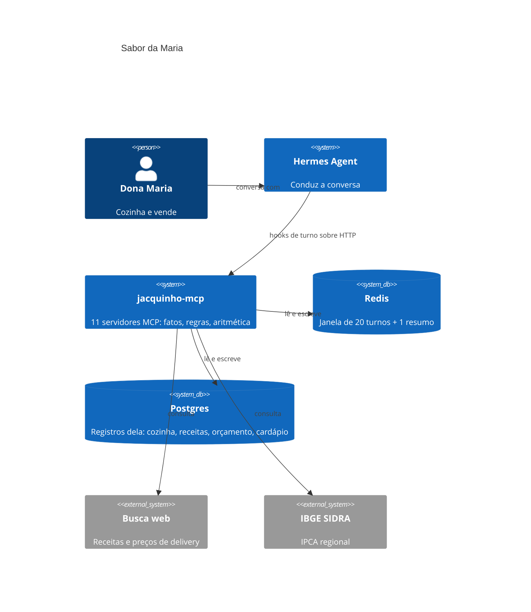
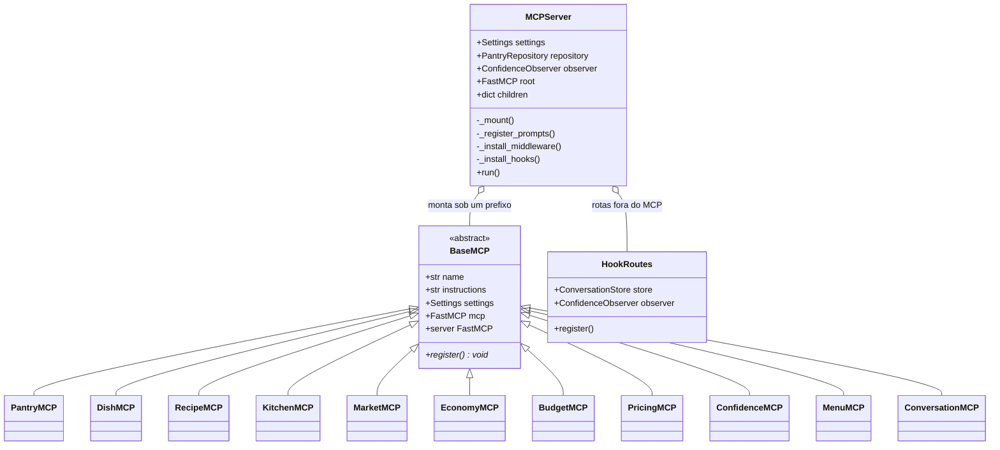
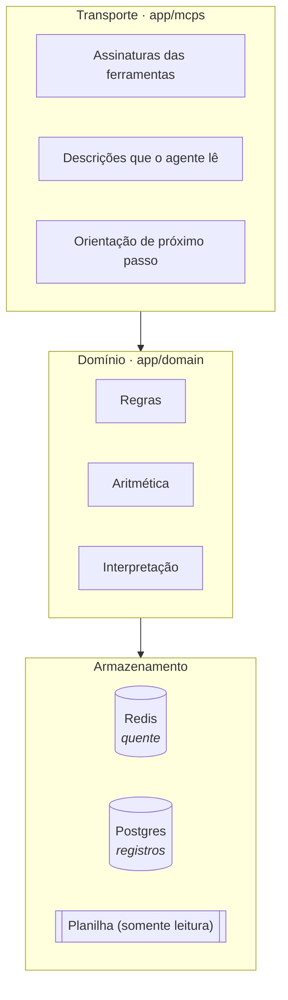
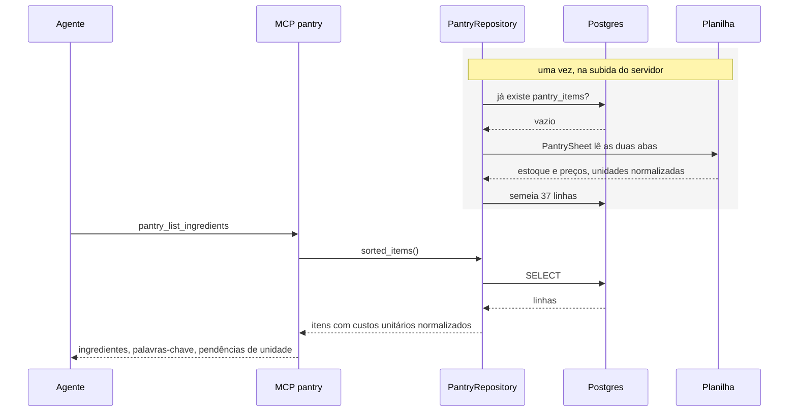
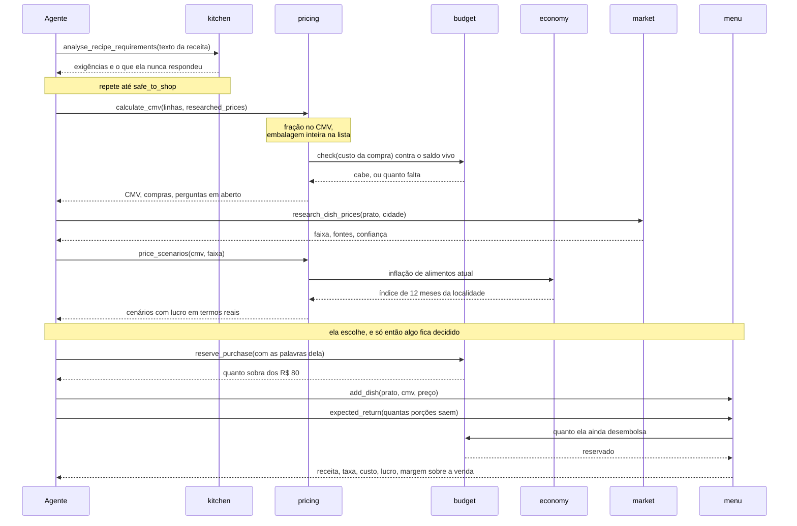
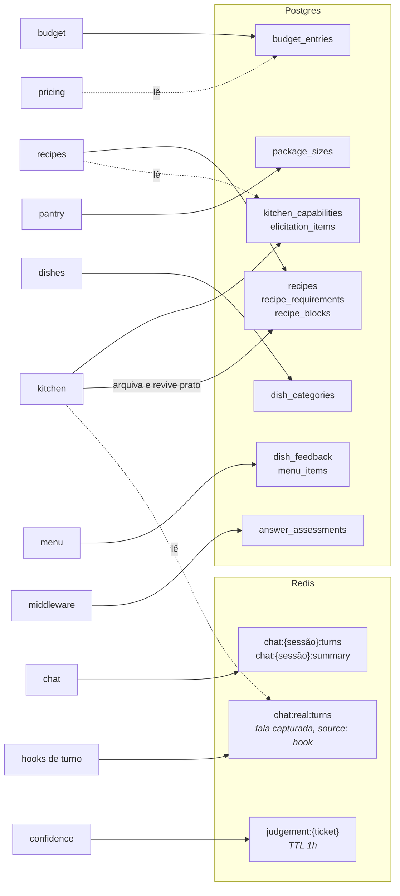

# Arquitetura

## O formato do sistema

O agente e o cálculo vivem em processos diferentes e conversam por MCP sobre
HTTP. O agente conduz a conversa e decide o que dizer. O servidor MCP guarda
todo fato, regra e número, e os devolve como dados.

## Composição

Cada servidor MCP é uma classe que deriva de `BaseMCP`. Ela declara um nome e
instruções, e então registra suas ferramentas. A raiz de composição constrói um
`FastMCP` raiz e monta cada filho sob um prefixo, de modo que uma ferramenta
chega ao agente como `pantry_list_ingredients`, `kitchen_elicitation_gaps`, e
assim por diante.

O `PantryRepository` é construído uma vez pela raiz de composição e injetado
nos servidores que precisam dele, de modo que a planilha é lida uma vez por
processo e todos os servidores enxergam custos unitários idênticos.

## Camadas

A camada de domínio não importa nada do FastMCP. Ela pode ser exercitada
diretamente, e é assim que o normalizador de unidades, o casador de
ingredientes, o motor de consenso e o mapeador de elicitação são verificados.

A camada de transporte carrega algo que o domínio deliberadamente não carrega:
o campo `next_step`. A maioria dos resultados termina nomeando a ferramenta que
deve vir em seguida. O procedimento viaja junto com o dado, em vez de depender
de o agente se lembrar dele.

## Onde o comportamento é definido

Não há arquivos de skill. O procedimento é entregue com o servidor; a voz não
pode ser, e mora do lado do agente:

| Portador | Onde | Alcance |
|---|---|---|
| `SOUL.md` | agente | Idioma, quem fala primeiro, postura |
| Instruções do servidor | MCP | Como uma área deve ser usada |
| Descrições das ferramentas | MCP | O que uma ferramenta faz e o que o resultado significa |
| `next_step` no resultado | MCP | O que fazer com o que acabou de voltar |
| Prompts | MCP | Os quatro procedimentos de várias etapas |

A divisão não é estética. O Hermes trata texto vindo por MCP como dado não
confiável, com um scanner de injeção sobre ele, e não injeta as `instructions`
de um servidor no system prompt. O que precisa estar no system prompt antes da
primeira ferramenta ser chamada, portanto, precisa ser um arquivo de contexto do
agente. `SOUL.md` é lido automaticamente de `HERMES_HOME`, sem chave de
configuração.

O que sobra do lado do servidor continua versionado junto do código que o impõe:
uma regra e a verificação que a torna verdadeira não se descolam.

## Caminhos de requisição

### Uma leitura da despensa

A planilha é semente, não fonte de leitura. Depois da primeira subida nada mais
a abre: o que a aplicação lê é o Postgres, e é por isso que um peso de embalagem
descoberto na conversa fica gravado em vez de se perder no próximo start.

### Um prato precificado

Duas leituras cruzadas aparecem aqui e são deliberadas: `pricing` consulta o
saldo do orçamento para que uma estimativa reflita o que já foi decidido, e
`menu` consulta o mesmo saldo para separar, no fechamento, o que a comida custa
do que ainda precisa sair do bolso dela.

## Posse do estado

Cada tabela tem um dono, com **uma** exceção declarada abaixo.

As travessias de **leitura** são deliberadas: `pricing` lê o saldo do orçamento
para que uma estimativa de custo reflita o dinheiro já gasto, `recipes` lê o
perfil da cozinha para ordenar o catálogo pelo que ela de fato consegue fazer, e
`kitchen` lê a fala capturada dela para conferir uma citação antes de aceitar um
`confirmed_yes`.

A travessia de **escrita**, e é a única, é `kitchen` sobre o catálogo de
receitas. Quando ela diz que não tem forno, é o `kitchen` que arquiva a lasanha
como bloqueada por `forno` na mesma chamada, e é o `kitchen` que levanta o
bloqueio quando ela diz que passou a ter um. Isso quebra a posse única de
propósito: mandar o agente ir até `recipes` fazer o registro depois é
exatamente o tipo de instrução que este projeto já aprendeu que ele pula, e o
custo de pular é a lasanha nunca voltar. A escrita passa pela mesma
`RecipeCatalogue` que `recipes` usa, então a regra do bloqueio condicional
continua num lugar só.

A divisão entre os dois armazenamentos é por tempo de vida. O Redis guarda o que
é reescrito a todo turno e perde valor depois: a janela de conversa e os tickets
de julgamento. O Postgres guarda o que a conversa decidiu, que sobrevive a
qualquer sessão e responde perguntas relacionais: um bloqueio existe por causa de
uma capacidade, e some quando ela muda.

## Postura diante de falhas

Toda dependência externa pode estar indisponível, e cada uma degrada para uma
lacuna declarada, nunca para um palpite.

| Dependência | Quando falha | Comportamento |
|---|---|---|
| Busca web | Provedor inalcançável | Devolve erro e manda perguntar a ela o que já cozinha bem |
| Preços de mercado | Nada encontrado | Só o preço mínimo; preço de venda é retido |
| IPCA | Fonte inalcançável | O lucro é rotulado como nominal e não conferido |
| Redis | Inalcançável | As operações reportam indisponibilidade; nada é perdido em silêncio |
| Postgres | Inalcançável | Idem: uma escrita que não aconteceu nunca é reportada como salva |
| Planilha | Ausente ou malformada | A inicialização falha em voz alta |

O padrão é uniforme: um resultado vazio é uma resposta de verdade, que precisa
ser dita em voz alta, nunca uma lacuna a ser preenchida com algo plausível.
