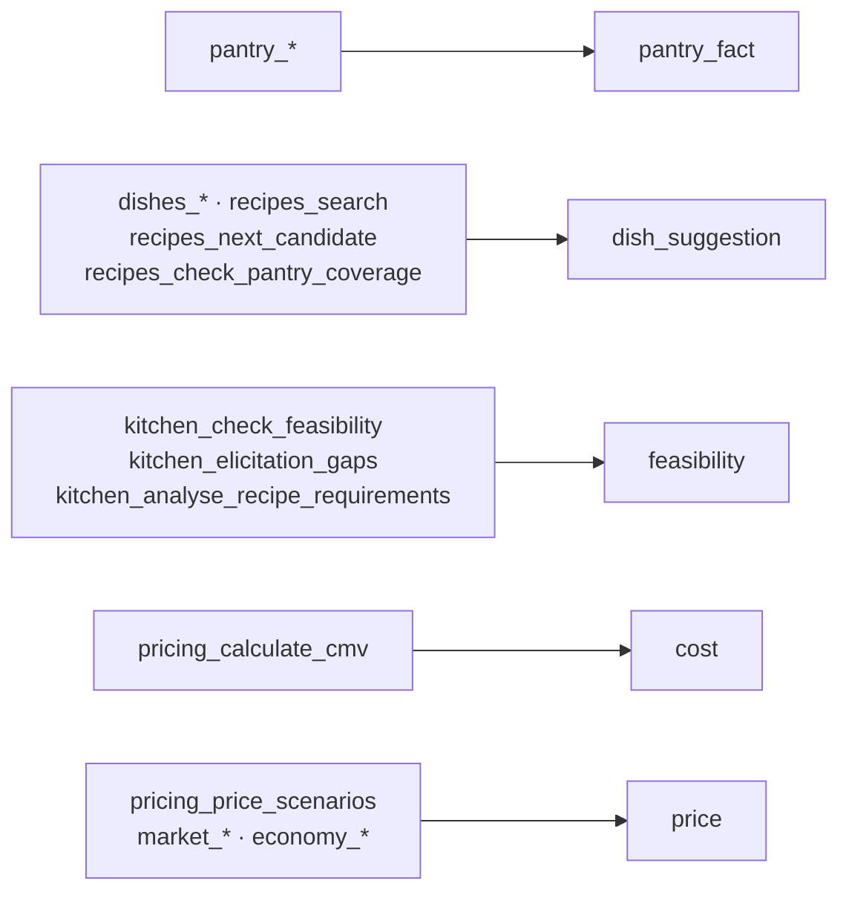

# Métricas


Este documento diz exatamente como a confiança é calculada, o que ela **não**
mede, e onde ela erra hoje.

## Índice

- [O que a nota significa](#o-que-a-nota-significa)
- [Os seis sinais](#os-seis-sinais)
- [As cinco afirmações](#as-cinco-afirmações)
- [A conta](#a-conta)
- [Impedimentos](#impedimentos)
- [O segundo avaliador](#o-segundo-avaliador)
- [Falhas conhecidas](#falhas-conhecidas-e-o-que-foi-feito)
- [Como melhorar](#como-melhorar)

---

## O que a nota significa

A nota responde **uma** pergunta: *a evidência reunida sustenta a afirmação que
está prestes a ser feita?*

Ela **não** mede se o conselho é bom, se o prato é gostoso, se o preço vai
vender, nem se o modelo escreveu bem. Mede apoio factual, e só.

Escala de 0 a 1, com duas bandas:

| Nota | Banda | Leitura |
|---:|---|---|
| ≥ 0,75 | alta | A afirmação está bem apoiada |
| ≥ 0,50 | média | Apoiada em parte; diga o que falta |
| < 0,50 | baixa | Não apresente como recomendação |

---

## Os seis sinais

Cada sinal é uma função determinística sobre o resultado de uma ferramenta. Sem
modelo, sem aleatoriedade: as mesmas entradas dão sempre a mesma nota.

### `pantry`, peso 20

| Estado | Nota |
|---|---:|
| A despensa foi lida nesta sessão | 1,00 |
| Não foi lida | 0,00 |

Binário de propósito. A planilha é determinística: ler é saber. Não há meio-termo
entre ter lido e não ter.

### `feasibility`, peso 25

Do veredito do portão de viabilidade.

| Veredito | Nota |
|---|---:|
| `approved` | 1,00 |
| `needs_answers` | 0,30 |
| `rejected` | 0,00 |
| O portão nunca rodou | 0,00 |

`needs_answers` não é zero porque perguntar é progresso, mas fica longe de
0,50, porque uma pergunta em aberto ainda impede a compra.

### `cost`, peso 25

Parte de 1,00 e desconta:

| Condição | Desconto |
|---|---:|
| CMV incompleto (`open_questions` ou ingrediente não encontrado) | fixa em 0,10 |
| A compra não cabe no orçamento restante | −0,30 |
| Alguma compra precificada pelo que ela pagou antes, não por cotação atual | −0,20 |

O último desconto é o mais fácil de esquecer: estimar o preço de um item novo
pelo histórico dela é um chute educado, não uma cotação.

### `web_consensus`, peso 20

Do maior `source_count` entre os pratos que passaram no consenso.

| Domínios distintos concordando | Nota |
|---:|---:|
| ≥ 4 | 1,00 |
| 3 | 0,80 |
| 2 | 0,60 |
| 1 | 0,25 |
| 0, ou busca não rodou | 0,00 |

Conta **domínios**, não páginas: cinco páginas do mesmo site são uma opinião.

### `market`, peso 20

Do número de fontes distintas com preço observado.

| Fontes distintas | Nota |
|---:|---:|
| ≥ 6 | 1,00 |
| 3 a 5 | 0,75 |
| 1 a 2 | 0,40 |
| 0 | 0,00 |

### `economy`, peso 10

Da idade do IPCA lido.

| Idade da referência | Nota |
|---|---:|
| ≤ 3 meses | 1,00 |
| ≤ 6 meses | 0,70 |
| mais | 0,30 |
| Não consultado | 0,00 |

Peso baixo de propósito: a inflação ajusta a leitura de uma margem, não decide
se ela existe.

---

## As cinco afirmações

Uma mensagem afirma um tipo de coisa, e só a evidência daquele tipo entra na
conta. Pontuar "você tem 37 ingredientes" contra o preço de mercado dá zero, e
não diz nada sobre a frase.

| Afirmação | Rótulo no badge | Sinais | Peso somado |
|---|---|---|---:|
| `pantry_fact` | o que ela tem | `pantry` | 20 |
| `dish_suggestion` | sugestão de prato | `pantry`, `web_consensus` | 40 |
| `feasibility` | se ela consegue fazer | `feasibility` | 25 |
| `cost` | custo | `pantry`, `feasibility`, `cost` | 70 |
| `price` | preço | `feasibility`, `cost`, `market`, `economy` | 80 |

O tipo em jogo é inferido da última ferramenta relevante que rodou:



Uma ferramenta fora dessa lista não muda a afirmação em jogo: ela apenas não
diz nada sobre o que está prestes a ser dito.

---

## A conta

Média ponderada sobre os sinais daquela afirmação:

```
nota = Σ(sinal × peso) / Σ(peso)
```

Exemplo, afirmação `price` com portão aprovado, CMV completo, duas fontes de
mercado e IPCA de dois meses:

| Sinal | Nota | Peso | Produto |
|---|---:|---:|---:|
| feasibility | 1,00 | 25 | 25,0 |
| cost | 1,00 | 25 | 25,0 |
| market | 0,40 | 20 | 8,0 |
| economy | 1,00 | 10 | 10,0 |
| | | **80** | **68,0** |

`68 / 80 = 0,85` → banda alta. O mercado fraco puxa para baixo mas não derruba,
o que está certo: duas fontes é pouco, não é nada.

---

## Impedimentos

Independentes da nota, e absolutos. Uma afirmação com impedimento não deve ser
enviada, mesmo pontuando bem.

| Afirmação | Impede se |
|---|---|
| `feasibility` | o portão não aprovou |
| `cost` | o portão não aprovou, ou o CMV está incompleto |
| `price` | o portão não aprovou, o CMV está incompleto, ou não há preço de mercado |

`pantry_fact` e `dish_suggestion` não têm impedimento: ler a despensa e propor um
nome não comprometem ninguém.

Três ferramentas vão além do aviso e são **recusadas** pelo middleware enquanto o
portão não aprovar. São elas `pricing_price_scenarios`, `menu_add_dish` e
`budget_reserve_purchase`. São as que mexem no dinheiro dela ou no cardápio.

---

## O segundo avaliador

O determinístico não pode ser convencido, mas só enxerga o que foi programado
para olhar. Ele não lê a mensagem: se o agente inventar um número que nenhuma
ferramenta produziu, a trilha de evidências continua igual e a nota não cai.

Por isso existe o juiz: um turno separado do mesmo modelo, com rubrica estrita,
que lê o rascunho contra as evidências e nomeia afirmações sem apoio. No modo
híbrido a nota final é **a menor das duas**, porque uma resposta vale o que diz o
revisor menos convencido. Discordância acima de 0,25 é reportada.

O juiz só roda quando o agente pede (`confidence_assess_answer` seguido de
`confidence_submit_judgement`). O observador roda sempre.

---

## Falhas conhecidas, e o que foi feito

Uma métrica cujos limites não estão escritos vira número mágico. As seis falhas
identificadas, e o estado de cada uma.

### 1. O observador não lê a mensagem · *mitigada*

Ele pontua a trilha de evidência, não o texto. Um agente que reúne evidência
impecável e depois escreve um número diferente do calculado recebe nota alta.

**Por que não dá para resolver de todo:** o middleware fica na fronteira do MCP.
Ele vê chamadas de ferramenta; a frase final nunca passa por ali.

**O que foi feito:** duas coisas. O único ato irreversível, `menu_add_dish`,
passou a exigir que uma avaliação tenha ocorrido para aquele prato. E
`confidence_audit_figures` passou a conferir, **sem modelo nenhum**, se cada
cifra e cada percentual da mensagem aparece no que as ferramentas devolveram.

O segundo é o que mais fecha a falha: o preço inventado, que é a coisa exata que
este sistema existe para impedir, agora é pego deterministicamente.

**Residual:** o que não é número. Uma frase que afirma que ela consegue assar
sem que o portão tenha aprovado continua dependendo do juiz, que continua
dependendo de ser chamado.

### 2. A afirmação era inferida, não declarada · *corrigida*

O tipo vinha da última ferramenta relevante. Numa mensagem que mistura assuntos,
só o último tipo era medido.

**O que foi feito:** `confidence_assess_answer` recebe `claim`, e uma afirmação
declarada tem precedência sobre a inferida pelo resto da sessão. A inferência
continua como padrão para quando nada foi declarado.

**Residual:** uma mensagem com duas afirmações ainda recebe uma nota só.

### 3. Os degraus são arbitrários · *explicitada, não resolvida*

Quatro domínios valendo 1,00 e três valendo 0,80 veio de julgamento, não de
medição. Ninguém verificou que pratos com quatro fontes dão menos errado.

**O que foi feito:** os degraus saíram de dentro das funções e viraram
`CONSENSUS_STEPS`, `MARKET_STEPS` e `ECONOMY_STEPS`, num só lugar, com a
docstring dizendo que são **ordinais, não calibrados**. Ordenam respostas
corretamente; o valor absoluto não é probabilidade de nada.

**Residual:** calibrar exige registrar desfecho (o prato foi aceito? o preço se
sustentou?) e ainda não há esse dado.

### 4. A sessão era global · *parcialmente corrigida*

Duas conversas simultâneas compartilhavam a mesma trilha.

**O que foi feito:** a trilha passou a ser chaveada por `(sessão, prato)`. Ao
implementar, descobriu-se que `ctx.session_id` é um **UUID novo a cada
requisição**, então cada chamada caía numa trilha própria e nada acumulava. A chave
passou a ser o header `mcp-session-id`, que é a conexão.

**Residual:** esse header não chega ao middleware nesta versão do FastMCP, então
a chave cai em `local`. Estável, e portanto correta para uma conversa por vez;
o isolamento real entre conversas simultâneas continua em aberto.

### 5. A trilha só crescia · *corrigida*

Evidência de um prato contava para outro. Aprovar a parmegiana e depois
perguntar sobre lasanha derrubava a aprovação da parmegiana, que era então
recusada no cardápio sem explicação.

**O que foi feito:** trilha por prato. A leitura da despensa continua
compartilhada, porque é sobre a cozinha dela e não sobre um prato. E o portão
ganhou o argumento `dish`, que ele não tinha, e por isso a aprovação caía numa
trilha sem nome.

### 6. `pantry` era binário · *corrigida*

Ler a despensa dava 1,00 mesmo para uma mensagem sobre ingrediente não
consultado. O sinal dizia "o arquivo foi aberto", não "isto foi verificado".

**O que foi feito:** quando uma receita é conferida com
`recipes_check_pantry_coverage`, a **cobertura** vira a nota: 0,5 para um de
dois ingredientes. A leitura da lista inteira continua valendo 1,00, que é
correto: aí a despensa toda é conhecida. Uma conferência específica não é
sobrescrita por uma leitura genérica posterior.

---

## Como melhorar

Em ordem de quanto corrigem por quanto custam.

### Fazer o juiz rodar sozinho

O que resta da falha 1. O middleware não alcança a mensagem final, mas o Hermes
tem hooks: um hook de pós-resposta enviaria o texto para julgamento sem depender
de o agente lembrar. É a maior melhoria que sobrou.

### Isolar sessões de verdade

O que resta da falha 4. Precisa de um identificador de conexão que chegue ao
middleware. As saídas são o header, um parâmetro de sessão nas ferramentas, ou um recurso do
FastMCP que ainda não existe nesta versão. Sem isso, duas conversas ao mesmo
tempo compartilham trilha.

### Uma nota por afirmação, não por mensagem

O que resta da falha 2. "Você tem frango, consegue fazer parmegiana, e eu
cobraria R$ 19,90" são três afirmações com apoios diferentes e recebem uma nota
só, a da última.

### Calibrar os degraus

O que resta da falha 3, e o mais caro. Registrar desfecho (o prato foi aceito?
o preço se sustentou? a compra coube?) e mover os limiares com base em dado.
É o que transforma a nota de heurística ordenada em medida.
