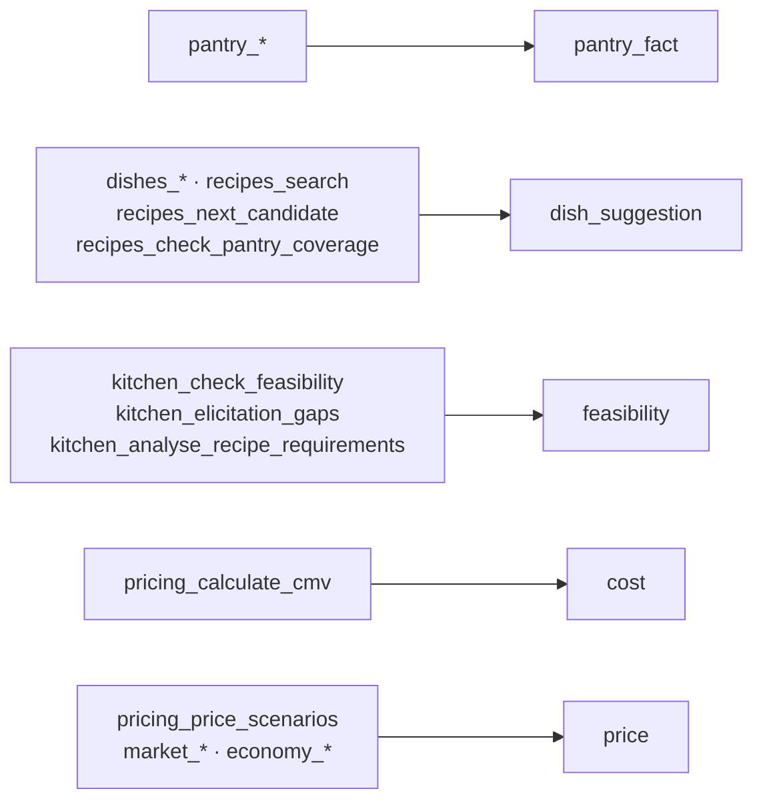
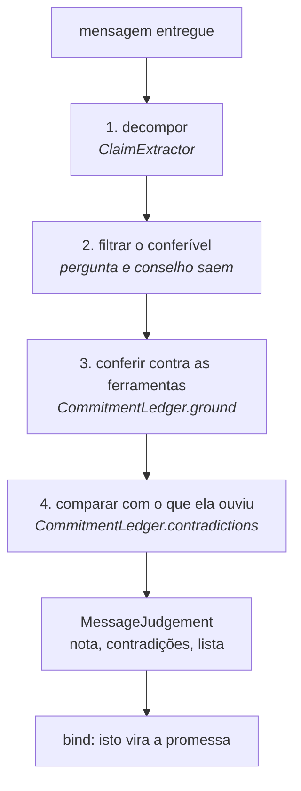

# Métricas


Este documento diz exatamente como a confiança é calculada, o que ela **não**
mede, e onde ela erra hoje.

## Índice

- [O que a nota significa](#o-que-a-nota-significa)
- [Os seis sinais](#os-seis-sinais)
- [As cinco afirmações](#as-cinco-afirmações)
- [A conta](#a-conta)
- [Impedimentos](#impedimentos)
- [O segundo avaliador](#o-segundo-avaliador)
- [Falhas conhecidas](#falhas-conhecidas-e-o-que-foi-feito)
- [A forma da mensagem](#a-forma-da-mensagem-message_pacing)
- [Como melhorar](#como-melhorar)

---

## O que a nota significa

A nota responde **uma** pergunta: *a evidência reunida sustenta a afirmação que
está prestes a ser feita?*

Ela **não** mede se o conselho é bom, se o prato é gostoso, se o preço vai
vender, nem se o modelo escreveu bem. Mede apoio factual, e só.

Escala de 0 a 1, com duas bandas:

| Nota | Banda | Leitura |
|---:|---|---|
| ≥ 0,75 | alta | A afirmação está bem apoiada |
| ≥ 0,50 | média | Apoiada em parte; diga o que falta |
| < 0,50 | baixa | Não apresente como recomendação |

---

## Os seis sinais

Cada sinal é uma função determinística sobre o resultado de uma ferramenta. Sem
modelo, sem aleatoriedade: as mesmas entradas dão sempre a mesma nota.

### `pantry`, peso 20

| Estado | Nota |
|---|---:|
| A despensa foi lida nesta sessão | 1,00 |
| Não foi lida | 0,00 |

Binário de propósito. A planilha é determinística: ler é saber. Não há meio-termo
entre ter lido e não ter.

### `feasibility`, peso 25

Do veredito do portão de viabilidade.

| Veredito | Nota |
|---|---:|
| `approved` | 1,00 |
| `needs_answers` | 0,30 |
| `rejected` | 0,00 |
| O portão nunca rodou | 0,00 |

`needs_answers` não é zero porque perguntar é progresso, mas fica longe de
0,50, porque uma pergunta em aberto ainda impede a compra.

### `cost`, peso 25

Parte de 1,00 e desconta:

| Condição | Desconto |
|---|---:|
| CMV incompleto (`open_questions` ou ingrediente não encontrado) | fixa em 0,10 |
| A compra não cabe no orçamento restante | −0,30 |
| Alguma compra precificada pelo que ela pagou antes, não por cotação atual | −0,20 |

O último desconto é o mais fácil de esquecer: estimar o preço de um item novo
pelo histórico dela é um chute educado, não uma cotação.

### `web_consensus`, peso 20

Do maior `source_count` entre os pratos que passaram no consenso.

| Domínios distintos concordando | Nota |
|---:|---:|
| ≥ 4 | 1,00 |
| 3 | 0,80 |
| 2 | 0,60 |
| 1 | 0,25 |
| 0, ou busca não rodou | 0,00 |

Conta **domínios**, não páginas: cinco páginas do mesmo site são uma opinião.

### `market`, peso 20

Do número de fontes distintas com preço observado.

| Fontes distintas | Nota |
|---:|---:|
| ≥ 6 | 1,00 |
| 3 a 5 | 0,75 |
| 1 a 2 | 0,40 |
| 0 | 0,00 |

### `economy`, peso 10

Da idade do IPCA lido.

| Idade da referência | Nota |
|---|---:|
| ≤ 3 meses | 1,00 |
| ≤ 6 meses | 0,70 |
| mais | 0,30 |
| Não consultado | 0,00 |

Peso baixo de propósito: a inflação ajusta a leitura de uma margem, não decide
se ela existe.

---

## As cinco afirmações

Uma mensagem afirma um tipo de coisa, e só a evidência daquele tipo entra na
conta. Pontuar "você tem 37 ingredientes" contra o preço de mercado dá zero, e
não diz nada sobre a frase.

| Afirmação | Rótulo no badge | Sinais | Peso somado |
|---|---|---|---:|
| `pantry_fact` | o que ela tem | `pantry` | 20 |
| `dish_suggestion` | sugestão de prato | `pantry`, `web_consensus` | 40 |
| `feasibility` | se ela consegue fazer | `feasibility` | 25 |
| `cost` | custo | `pantry`, `feasibility`, `cost` | 70 |
| `price` | preço | `feasibility`, `cost`, `market`, `economy` | 80 |

O tipo em jogo é inferido da última ferramenta relevante que rodou:



Uma ferramenta fora dessa lista não muda a afirmação em jogo: ela apenas não
diz nada sobre o que está prestes a ser dito.

---

## A conta

Média ponderada sobre os sinais daquela afirmação:

```
nota = Σ(sinal × peso) / Σ(peso)
```

Exemplo, afirmação `price` com portão aprovado, CMV completo, duas fontes de
mercado e IPCA de dois meses:

| Sinal | Nota | Peso | Produto |
|---|---:|---:|---:|
| feasibility | 1,00 | 25 | 25,0 |
| cost | 1,00 | 25 | 25,0 |
| market | 0,40 | 20 | 8,0 |
| economy | 1,00 | 10 | 10,0 |
| | | **80** | **68,0** |

`68 / 80 = 0,85` → banda alta. O mercado fraco puxa para baixo mas não derruba,
o que está certo: duas fontes é pouco, não é nada.

---

## Impedimentos

Independentes da nota, e absolutos. Uma afirmação com impedimento não deve ser
enviada, mesmo pontuando bem.

| Afirmação | Impede se |
|---|---|
| `feasibility` | o portão não aprovou |
| `cost` | o portão não aprovou, ou o CMV está incompleto |
| `price` | o portão não aprovou, o CMV está incompleto, ou não há preço de mercado |

`pantry_fact` e `dish_suggestion` não têm impedimento: ler a despensa e propor um
nome não comprometem ninguém.

Três ferramentas vão além do aviso e são **recusadas** pelo middleware enquanto o
portão não aprovar. São elas `pricing_price_scenarios`, `menu_add_dish` e
`budget_reserve_purchase`. São as que mexem no dinheiro dela ou no cardápio.

---

## O segundo avaliador

O determinístico não pode ser convencido, mas só enxerga o que foi programado
para olhar. Ele não lê a mensagem: se o agente inventar um número que nenhuma
ferramenta produziu, a trilha de evidências continua igual e a nota não cai.

Por isso existe o juiz: um turno separado do mesmo modelo, com rubrica estrita,
que lê o rascunho contra as evidências e nomeia afirmações sem apoio. No modo
híbrido a nota final é **a menor das duas**, porque uma resposta vale o que diz o
revisor menos convencido. Discordância acima de 0,25 é reportada.

O juiz só roda quando o agente pede (`confidence_assess_answer` seguido de
`confidence_submit_judgement`). O observador roda sempre.

---

## Falhas conhecidas, e o que foi feito

Uma métrica cujos limites não estão escritos vira número mágico. As seis falhas
identificadas, e o estado de cada uma.

### 1. O observador não lê a mensagem · *mitigada*

Ele pontua a trilha de evidência, não o texto. Um agente que reúne evidência
impecável e depois escreve um número diferente do calculado recebe nota alta.

**Por que não dá para resolver de todo:** o middleware fica na fronteira do MCP.
Ele vê chamadas de ferramenta; a frase final nunca passa por ali.

**O que foi feito:** duas coisas. O único ato irreversível, `menu_add_dish`,
passou a exigir que uma avaliação tenha ocorrido para aquele prato. E
`confidence_audit_figures` passou a conferir, **sem modelo nenhum**, se cada
cifra e cada percentual da mensagem aparece no que as ferramentas devolveram.

O segundo é o que mais fecha a falha: o preço inventado, que é a coisa exata que
este sistema existe para impedir, agora é pego deterministicamente.

**Residual:** o que não é número. Uma frase que afirma que ela consegue assar
sem que o portão tenha aprovado continua dependendo do juiz, que continua
dependendo de ser chamado.

### 2. A afirmação era inferida, não declarada · *corrigida*

O tipo vinha da última ferramenta relevante. Numa mensagem que mistura assuntos,
só o último tipo era medido.

**O que foi feito:** `confidence_assess_answer` recebe `claim`, e uma afirmação
declarada tem precedência sobre a inferida pelo resto da sessão. A inferência
continua como padrão para quando nada foi declarado.

**Residual:** uma mensagem com duas afirmações ainda recebe uma nota só.

### 3. Os degraus são arbitrários · *explicitada, não resolvida*

Quatro domínios valendo 1,00 e três valendo 0,80 veio de julgamento, não de
medição. Ninguém verificou que pratos com quatro fontes dão menos errado.

**O que foi feito:** os degraus saíram de dentro das funções e viraram
`CONSENSUS_STEPS`, `MARKET_STEPS` e `ECONOMY_STEPS`, num só lugar, com a
docstring dizendo que são **ordinais, não calibrados**. Ordenam respostas
corretamente; o valor absoluto não é probabilidade de nada.

**Residual:** calibrar exige registrar desfecho (o prato foi aceito? o preço se
sustentou?) e ainda não há esse dado.

### 4. A sessão era global · *parcialmente corrigida*

Duas conversas simultâneas compartilhavam a mesma trilha.

**O que foi feito:** a trilha passou a ser chaveada por `(sessão, prato)`. Ao
implementar, descobriu-se que `ctx.session_id` é um **UUID novo a cada
requisição**, então cada chamada caía numa trilha própria e nada acumulava. A chave
passou a ser o header `mcp-session-id`, que é a conexão.

**Residual:** esse header não chega ao middleware nesta versão do FastMCP, então
a chave cai em `local`. Estável, e portanto correta para uma conversa por vez;
o isolamento real entre conversas simultâneas continua em aberto.

### 5. A trilha só crescia · *corrigida*

Evidência de um prato contava para outro. Aprovar a parmegiana e depois
perguntar sobre lasanha derrubava a aprovação da parmegiana, que era então
recusada no cardápio sem explicação.

**O que foi feito:** trilha por prato. A leitura da despensa continua
compartilhada, porque é sobre a cozinha dela e não sobre um prato. E o portão
ganhou o argumento `dish`, que ele não tinha, e por isso a aprovação caía numa
trilha sem nome.

### 6. `pantry` era binário · *corrigida*

Ler a despensa dava 1,00 mesmo para uma mensagem sobre ingrediente não
consultado. O sinal dizia "o arquivo foi aberto", não "isto foi verificado".

**O que foi feito:** quando uma receita é conferida com
`recipes_check_pantry_coverage`, a **cobertura** vira a nota: 0,5 para um de
dois ingredientes. A leitura da lista inteira continua valendo 1,00, que é
correto: aí a despensa toda é conhecida. Uma conferência específica não é
sobrescrita por uma leitura genérica posterior.

---

## Como melhorar

Em ordem de quanto corrigem por quanto custam.

### Fazer o juiz rodar sozinho

O que resta da falha 1. O middleware não alcança a mensagem final, mas o Hermes
tem hooks: um hook de pós-resposta enviaria o texto para julgamento sem depender
de o agente lembrar. É a maior melhoria que sobrou.

### Isolar sessões de verdade

O que resta da falha 4. Precisa de um identificador de conexão que chegue ao
middleware. As saídas são o header, um parâmetro de sessão nas ferramentas, ou um recurso do
FastMCP que ainda não existe nesta versão. Sem isso, duas conversas ao mesmo
tempo compartilham trilha.

### Uma nota por afirmação, não por mensagem

O que resta da falha 2. "Você tem frango, consegue fazer parmegiana, e eu
cobraria R$ 19,90" são três afirmações com apoios diferentes e recebem uma nota
só, a da última.

### A conferência de cifras que roda sozinha

`confidence_audit_figures` sempre existiu e sempre foi opcional, e por isso não
rodou no turno em que mais importava: uma mensagem disse à Dona Maria que
sobravam R$ 7,26 por marmita quando a ferramenta tinha devolvido R$ 5,27, com a
taxa da plataforma esquecida na subtração feita em prosa.

Agora a mesma conferência roda na fronteira do turno, contra **todos** os
números que qualquer ferramenta produziu na sessão. Isso exigiu guardar mais que
a trilha de evidências, que tem seis compartimentos e não guarda nem preço nem
cardápio, ou seja, justamente as cifras que ela usa para decidir.

É uma métrica grosseira de propósito: pergunta se a cifra existe em algum
resultado, não se está no lugar certo da frase. Não pega um número certo usado
errado. Pega o número que ninguém calculou, e sai como `jacquinho.figures` no
log. Ver [decisoes.md](decisoes.md), item 37.

## Afirmações atômicas: o pipeline por mensagem

A pontuação por sinais mede a **evidência reunida**. Não mede a frase. Esta
segunda camada mede a frase, e roda na fronteira do turno, sobre o texto que a
Dona Maria realmente recebeu.

### Os quatro passos



### Os tipos, em Pydantic

Os modelos existem para que cada peça do pipeline tenha um contrato explícito, e
para que o resultado seja serializável direto no log e no banco.

| Modelo | O que é | Campos que decidem alguma coisa |
|---|---|---|
| `AtomicClaim` | Uma afirmação, pequena o bastante para ser verdadeira ou falsa sozinha | `kind`, `subject`, `value`, `exclusive` |
| `ToolFact` | Um valor que uma ferramenta estabeleceu para um prato | `subject`, `kind`, `value` |
| `CheckedClaim` | Uma afirmação com o que aconteceu com ela | `verdict`, `earlier_value` |
| `MessageJudgement` | A nota da mensagem inteira | `score`, `contradictions`, `verifiable` |

`ClaimKind` é um `str, Enum`: `cost`, `price`, `receipt`, `profit`, `budget`,
`market`, `unverifiable`. `Verdict` também: `grounded`, `ungrounded`,
`contradicts_earlier_turn`, `revised_because_she_asked`, `not_checkable`.

### O que é atômico, e por quê

Uma afirmação é atômica quando pode ser julgada sem depender de outra frase.
"Cada marmita custa R$ 4,15 e vendendo a R$ 24,90 sobra R$ 18,26" são **três**
afirmações, e a do meio pode estar certa com as outras erradas.

A atomicidade só vale se cada átomo tiver **identidade estável**, e é aí que
esteve o erro de projeto mais caro desta camada. A primeira versão lia o tipo da
afirmação pelas palavras ao redor do número. Parecia razoável: *"custa R$ 4,15"*
é custo, *"sobra R$ 18,26"* é lucro. Mas *"sobram R$ 63,91 dos seus R$ 80"* é o
orçamento, e todas as pistas que o classificariam como lucro estão na frase.

Tipo errado é pior que nenhum, porque inventa contradição entre dois números que
nunca falaram da mesma coisa. Hoje a identidade vem de **quem produziu o valor**:
o custo é o que `calculate_cmv` devolveu para aquele prato, o preço é o que foi
para o cardápio. A leitura da frase serve só para saber **quais** desses valores
ela de fato ouviu.

O mesmo princípio aparece uma camada abaixo, na receita: um prato tem uma lista
de ingredientes, fechada na primeira conta completa. Sem isso o custo andava
sozinho entre turnos com aritmética correta em todas as vezes, porque os insumos
mudavam. Ver [decisoes.md](decisoes.md), itens 43 e 46.

### O mapa das saídas de MCP

A conferência só significa alguma coisa se for contra o que os servidores
produziram. `app/domain/facts.py` declara isso campo a campo:

| Ferramenta | Campo | Tipo | Decide? |
|---|---|---|---|
| `pricing_calculate_cmv` | `cmv_per_portion` | custo | **sim** |
| `pricing_calculate_cmv` | `shopping_cost` | orçamento | **sim** |
| `pricing_price_scenarios` | `scenarios[].selling_price` | preço | não |
| `pricing_price_scenarios` | `scenarios[].profit_per_portion` | lucro | não |
| `market_research_dish_prices` | `reference.{min,median,max}` | mercado | não |
| `budget_*` | `remaining`, `shortfall`, … | orçamento | não |
| `menu_add_dish` | `price`, `she_receives`, `profit`, `cmv` | preço, líquido, lucro, custo | **sim** |
| `menu_expected_return` | `revenue`, `profit`, `production_cost`, … | vários | não |
| `pantry_*` | `unit_cost`, `price_paid` | despensa | não |

Duas colunas carregam o desenho.

**"Decide"** separa lastro de compromisso. `price_scenarios` devolve três
preços: são candidatos, e nenhum é o preço do prato. Só o que foi para o
cardápio compromete. Marcar todo número produzido como compromisso
transformaria "aqui estão três opções" em três contradições no turno seguinte.

**Só campos de saída entram.** Uma ferramenta é evidência do que calcula; o que
ela recebe é o modelo conversando consigo mesmo. A subtração é genérica: os
números do resultado menos os números dos argumentos, para toda chamada. Sem
isso um total de compras escolhido pelo modelo servia de prova de si próprio.

Um mapa apontando para campo inexistente é pior que mapa nenhum, porque falha
em silêncio. Um teste percorre o mapa e confirma que cada nome existe no código
que o produz; ele pegou quatro campos inventados na primeira escrita.

### A conta

```
nota = afirmações que conferem / afirmações conferíveis
nota = 0,00                     se houver qualquer contradição
nota = 1,00                     se não houver nada conferível
```

A contradição zera em vez de entrar na média porque ouvir dois custos diferentes
para o mesmo prato não é oitenta por cento certo. E mensagem sem nada conferível
vale 1,00 porque uma pergunta não pode estar errada: pontuá-la baixo mediria o
avaliador, não a mensagem.

Mudança que **ela** pediu não é contradição. `pricing_reopen_recipe` autoriza a
revisão daquele prato e o valor novo passa como `revised`. Sem isso o sistema
puniria o agente por corrigir na frente dela, e o que ele aprenderia é a
esconder a correção.

### De onde veio o desenho

O método é o que a literatura de verificação de fatos de texto longo convergiu,
com uma adaptação que muda o custo de rodá-lo.

**Decompor e verificar uma afirmação por vez** é o método do FActScore e do SAFE,
que quebram uma resposta longa em fatos atômicos e verificam cada um contra uma
fonte, reportando precisão.

**Filtrar para as verificáveis** é a correção que o [VeriScore][veriscore] fez em
cima disso: ele extrai apenas afirmações verificáveis e descarta opinião,
conselho, hipótese e ficção, porque essas não podem ser certas nem erradas.
Também é de lá a ideia de **descontextualizar** a afirmação com uma janela ao
redor da frase, para que ela se sustente sozinha; aqui a janela é curta e cortada
no limite da frase, porque uma janela larga faz todo número do parágrafo herdar o
sentido do primeiro.

**Comparar contra turnos anteriores** é o que os avaliadores multi-turno chamam
de *commitment*. O [SKG-Eval][skg] monta um grafo incremental do diálogo e roda
uma cascata de detectores de contradição, e o mais confiável deles para o nosso
caso é a **discordância numérica**: relações iguais, valores diferentes. É
robusto justamente por comparar valores simbólicos em vez de similaridade de
texto. De lá vem também o **filtro de revisão autorizada**, que separa uma
atualização pedida pelo usuário de uma inconsistência do modelo, e a distinção
entre propriedade **exclusiva** e **aditiva**: um prato tem um custo, mas pode
ter várias referências de mercado.

Há discussão aberta sobre quando decompor ajuda e quando atrapalha, e sobre como
pontuar a qualidade da própria decomposição
([Decomposition Dilemmas][decomp], [DecMetrics][decmetrics]).

**A adaptação.** Nesses trabalhos a evidência é a web aberta, então a extração
precisa de um modelo e a verificação precisa de busca, e o custo por resposta é
alto o bastante para virar decisão de produto. Aqui a evidência são os resultados
das próprias ferramentas desta sessão: um preço saiu de
`pricing_price_scenarios` ou não saiu. Por isso o pipeline inteiro é
determinístico, cabe em `test_claims.py` sem banco nem servidor, e roda em toda
mensagem sem custar uma chamada de modelo.

[veriscore]: https://arxiv.org/html/2406.19276
[skg]: https://arxiv.org/html/2605.16650
[decomp]: https://arxiv.org/html/2411.02400v1
[decmetrics]: https://arxiv.org/html/2509.04483

**Nota de honestidade sobre estas referências.** Li o VeriScore e o SKG-Eval em
detalhe e tirei deles as decisões acima. Os outros dois apareceram no
levantamento e são citados como leitura relacionada, não como base do desenho.
FActScore e SAFE são citados pelo método que popularizaram, que chega aqui
através da descrição desses trabalhos.

### O que esta camada não faz

Ela pergunta se a cifra existe em algum resultado de ferramenta e se bate com o
que foi prometido. **Não** pergunta se está no lugar certo da frase: um número
certo usado para a coisa errada passa. Também não julga texto sem número, que é
onde mora a maior parte de uma conversa.

Para isso continua existindo o juiz, que lê o rascunho, e ele é a única parte
paga desta pilha.

E não julga a **forma**. Uma mensagem pode estar inteiramente lastreada e ainda
ser ilegível para ela, e esse é um defeito diferente — medido à parte, logo
abaixo.

## A forma da mensagem: `message_pacing`

Uma medida separada, que sai em `confidence_assess_answer` junto da nota e
**não entra nela**. A nota responde "isso é verdade?"; esta responde "ela vai
conseguir ler?". Somar as duas apagaria as duas: uma parede perfeitamente
lastreada continuaria com nota alta, e uma frase curta e chutada também.

| Campo | O que é |
|---|---|
| `one_subject_per_part` | O veredito. `false` significa quebre antes de mandar |
| `parts` | Em quantas partes o rascunho está, contando por quebra de linha |
| `subjects` | Que decisões a mensagem inteira está resolvendo |
| `questions` | Cada frase que pergunta alguma coisa a ela |
| `split_because` | Por que está reprovado, na língua do agente |
| `how_to_split` | Onde é a costura |

Três regras, e nenhuma delas é sobre tamanho:

1. **Nenhuma parte resolve mais de dois assuntos.** Prato, cozinha, custo,
   compras, orçamento, mercado e preço são decisões diferentes; soldadas num
   parágrafo, ela passa o olho e o que estava no meio se perde.
2. **Nenhuma parte passa de oitenta palavras.** Uma parte pode ser sobre uma
   coisa só e ainda ser uma página dela.
3. **Uma pergunta, na última parte.** Pergunta no meio é pergunta que ela não vê;
   duas perguntas na mesma mensagem viram uma, porque ela responde a primeira.

O que os assuntos detectam são **decisões**, não substantivos: "quando for ao
mercado" não é referência de mercado, e uma panela citada numa receita não é uma
pergunta sobre a cozinha dela. Os marcadores são frases, não palavras soltas,
justamente por isso.

A ferramenta nunca reescreve a mensagem. Prosa quebrada por regra soa quebrada,
e o agente já sabe onde os próprios parágrafos terminam — o que volta é a
costura, no instante em que ele já está perguntando se o rascunho está pronto.

Quando uma parede sai mesmo assim, o gancho de fim de turno grava
`jacquinho.pacing` com as partes, os assuntos e o motivo. Não é um portão: é
como se sabe com que frequência o portão está sendo contornado.

### Calibrar os degraus

O que resta da falha 3, e o mais caro. Registrar desfecho (o prato foi aceito?
o preço se sustentou? a compra coube?) e mover os limiares com base em dado.
É o que transforma a nota de heurística ordenada em medida.
