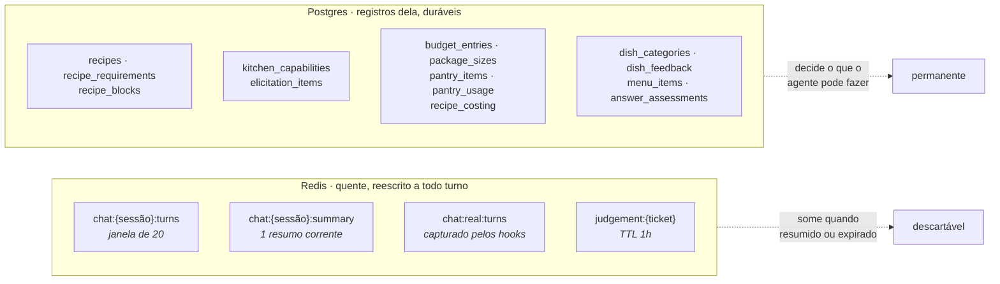
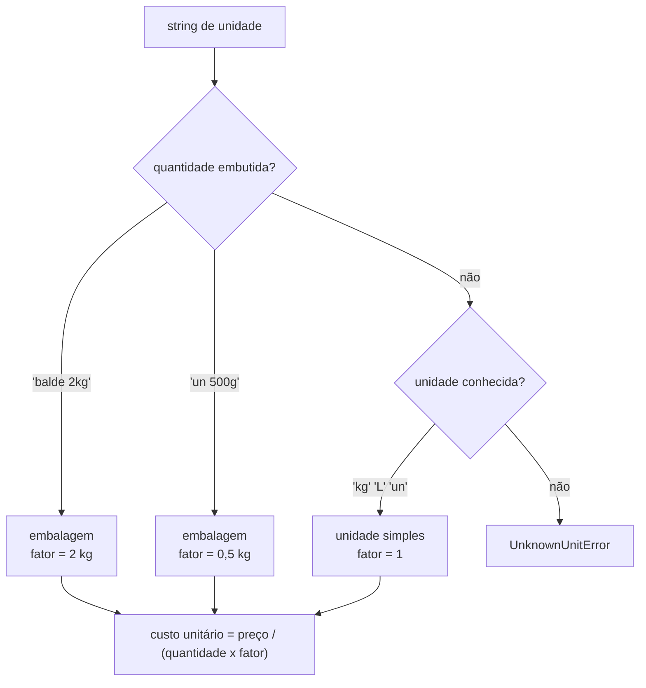
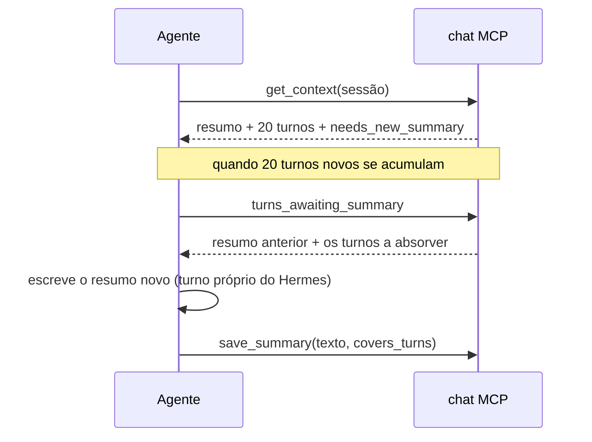
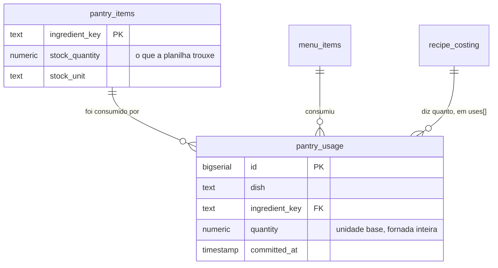
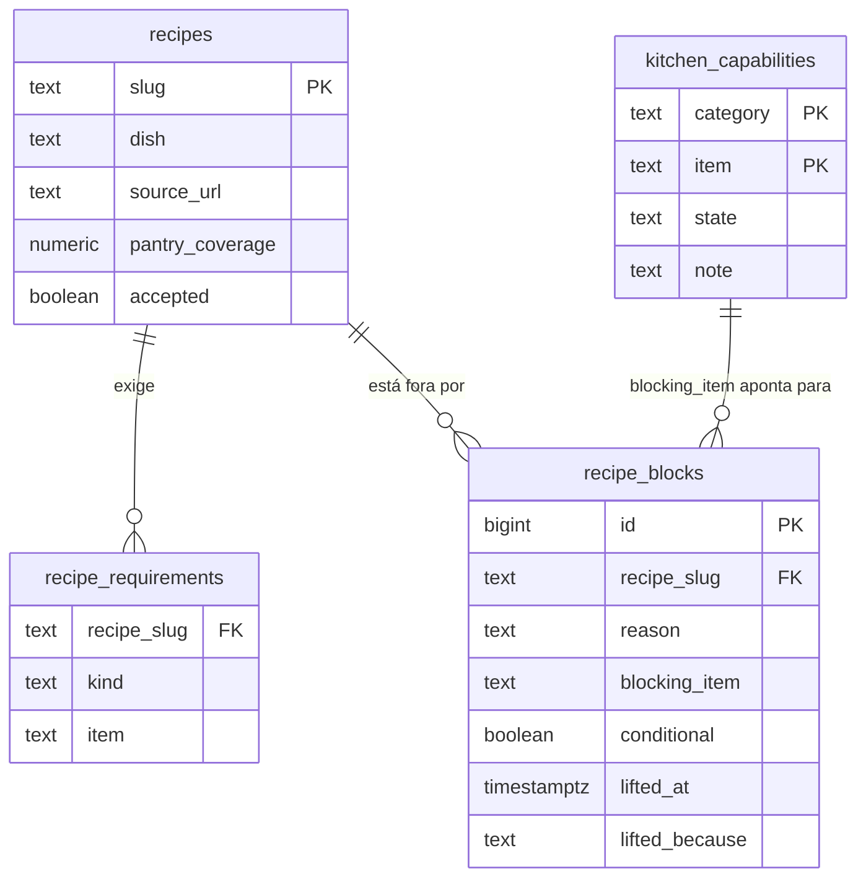
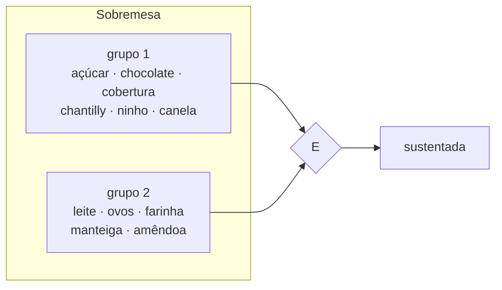

# Modelo de dados

A divisão entre os dois armazenamentos é por **tempo de vida**, não por
conveniência.




## A planilha

Duas abas, cruzadas pelo nome do ingrediente.

| Aba | Colunas |
|---|---|
| `Despensa` | Ingrediente · Quantidade em estoque · Unidade |
| `Precos` | Ingrediente · Quantidade comprada · Unidade · Preço total pago (R$) |

O arquivo é montado somente para leitura. Nada é jamais escrito de volta nele.

### Normalização de unidades

Uma string de unidade pode ser uma unidade, ou a descrição de uma embalagem com
a quantidade dentro dela. As duas resolvem para uma unidade base por dimensão.



| Dimensão | Unidade base |
|---|---|
| massa | kg |
| volume | L |
| contagem | un |

Um item precificado por peça avulsa sem peso declarado é marcado como
`priced_per_piece`. Ele serve para receitas que contam unidades. Uma receita que
peça massa ou volume de um item assim produz uma pergunta, e a resposta é
gravada para que o custo passe a ser calculável.

### Casamento de nomes

Os nomes são normalizados (minúsculas, acentos removidos, pontuação colapsada)
e casados por sobreposição de tokens significativos, com conectivos excluídos.
Abaixo do limiar não se devolve nada, e sugestões são oferecidas no lugar.

---

## Redis, o que é quente

Persistência append-only. Toda operação reporta indisponibilidade em vez de
falhar em silêncio.

| Chave | Tipo | Conteúdo |
|---|---|---|
| `chat:sessions` | conjunto | Identificadores de conversa conhecidos |
| `chat:{sessão}:turns` | lista | Turnos, limitados a 2000, os mais antigos descartados |
| `chat:{sessão}:summary` | string | O resumo corrente e quantos turnos ele cobre |
| `chat:real:turns` | lista | O que os hooks capturaram do turno, marcado `source: hook` |
| `judgement:{ticket}` | string | Ticket de julgamento aberto, TTL de uma hora |

A distinção entre as duas primeiras listas e a terceira é a que sustenta a
conferência de citações. Tudo que o agente grava com `chat_save_turn` sai
marcado `source: agent`; o que os hooks de fronteira de turno capturam sai
`source: hook`. Existindo qualquer turno capturado, **só ele** vale para
confirmar que uma frase foi dita por ela.

### A janela de 20 mais 1

O contexto entregue ao agente é sempre os **20 últimos turnos**, na prática cerca
de dez dela e dez do agente, mais **uma** mensagem de resumo representando tudo
antes deles.



| Marco | Janela | Resumo cobre | Desde o resumo | Precisa novo |
|---:|---:|---:|---:|---|
| 10 turnos | 10 | 0 | 10 | não |
| 20 turnos | 20 | 0 | 20 | **sim** |
| 25 turnos | 20 | 20 | 5 | não |
| 40 turnos | 20 | 20 | 20 | **sim** |

Os turnos antigos continuam gravados: o corte é do que o agente segura, não do
que se guarda. `RPUSH` para gravar e `LRANGE` dos últimos vinte para ler são
operações de tempo constante, e o efeito que mais importa é que o custo em tokens
por turno fica limitado por construção.

O resumo é escrito pelo próprio Hermes, num turno separado. Nenhum segundo modelo
entra no circuito.

---

## Postgres, os registros dela

Treze tabelas, um dono para cada.

### Por que os utensílios dela não ficam no Redis

É a pergunta que a divisão convida, e a resposta é o que separa as duas metades
deste documento. O que ela **tem** (fogão, panela de pressão, air fryer, a
técnica que ela domina, o espaço na geladeira) é registro, não conversa:

*Um bloqueio é uma relação, não um valor.* A lasanha saiu **por causa do**
forno. No dia em que o forno aparece, os pratos que esperavam por ele voltam com
`UPDATE recipe_blocks … WHERE blocking_item = 'forno' RETURNING`. Em chave-valor
isso é varrer tudo e reconstruir em Python, e a volta silenciosamente para de
acontecer quando alguém esquece de varrer.

*O Redis aqui tem janela.* A conversa é cortada em vinte turnos por construção.
Um perfil de cozinha guardado na conversa desapareceria junto com ela, e a
consultoria seguinte começaria perguntando tudo de novo, que é exatamente o
que a regra mais importante deste agente proíbe.

*A pergunta "o que ela ainda não respondeu" é uma consulta.* `unknown` é um
estado guardado, e é assim que `kitchen_next_questions` sabe o que falta sem o
modelo deduzir nada. Contar o que não existe é mais difícil do que ler uma
coluna.

O Redis guarda o que a conversa precisa **agora**: os últimos turnos, o resumo,
as fichas de julgamento com TTL. O Postgres guarda o que a conversa **decidiu**.
Um item vai para o Redis quando perdê-lo custa contexto; vai para o Postgres
quando perdê-lo custa uma pergunta repetida ou dinheiro gasto duas vezes.

A exceção que confirma a regra é a fala dela capturada pelos hooks
(`chat:real:turns`): fica no Redis porque é conversa, e o lado do Postgres só a
consulta para conferir uma citação no instante da gravação. Depois disso, o que
sobrevive é a capacidade, com as palavras dela copiadas na nota.

| Tabela | Dono | Conteúdo |
|---|---|---|
| `pantry_items` | `pantry` | A despensa semeada da planilha, com custos unitários |
| `pantry_usage` | `pantry`, escrita pelo `menu` | O que cada prato aceito levou da despensa; o estoque disponível é a subtração |
| `package_sizes` | `pantry` | Pesos descobertos para itens vendidos por peça |
| `recipes` | `recipes`, e `kitchen` | Toda receita já aberta, com fonte e cobertura |
| `recipe_requirements` | `recipes` | O que cada receita exige: equipamento e técnica |
| `recipe_blocks` | `recipes`, e `kitchen` | Por que um prato saiu, e o que o traria de volta |
| `kitchen_capabilities` | `kitchen` | Capacidades em três estados, com as palavras dela |
| `elicitation_items` | `kitchen` | Restrições acrescentadas durante a conversa |
| `recipe_costing` | `pricing` | A receita fechada de um prato: lista, porções, custo, o que a fornada tira da despensa, e o motivo de cada reabertura nas palavras dela |
| `budget_entries` | `budget` | Compras fechadas; o saldo é derivado |
| `dish_categories` | `dishes` | Categorias criadas durante a conversa |
| `dish_feedback` | `menu` | O que ela achou de cada prato |
| `menu_items` | `menu` | O cardápio de lançamento |
| `answer_assessments` | o middleware | Cada resposta avaliada: tipo de afirmação, notas, badge e impedimentos |

Os dois donos de `recipes` e `recipe_blocks` são deliberados e são a única
exceção à posse única. Quando ela diz que não tem forno, é o `kitchen` que
arquiva a lasanha ali mesmo, e é o `kitchen` que levanta o bloqueio quando ela
diz que passou a ter um. Mandar o agente ir até `recipes` fazer isso depois é o
tipo de instrução que este projeto já aprendeu que ele pula, e o custo de pular
é a lasanha nunca voltar. A escrita passa pela mesma `RecipeCatalogue`, então a
regra do bloqueio condicional continua num lugar só.

`answer_assessments` não tem dono entre os servidores porque quem escreve é o
middleware, depois de toda chamada de ferramenta, sem o agente pedir.

`pantry_usage` é a segunda exceção à posse única, e pela mesma razão que a
primeira: quem lê é o `pantry`, mas quem escreve é o `menu`, no instante em que
ela aceita o prato. Orçar não gasta nada; escolher, sim. Deixar o `pricing`
escrever ali esvaziaria a despensa a cada pergunta.

### O estoque que baixa

Duas tabelas, e uma subtração. `pantry_items` guarda o que a planilha semeou e
nunca é reescrita; `pantry_usage` recebe uma linha por ingrediente por prato
aceito. O estoque disponível é a diferença, calculada na leitura.



O caminho de volta é a exclusão das linhas do prato: `menu_remove_dish` e
`pricing_reopen_recipe` apagam o que aquele prato tinha levado. Guardar o
consumo separado do estoque é o que torna isso possível sem reconstruir nada — e
é o que permite a frase que ela precisa ouvir, *"você tinha 1,5 kg, a lasanha
levou 1 kg, sobraram 500 g"*, que um saldo sozinho não teria como contar.

### O bloqueio que se desfaz sozinho



Um bloqueio nunca é apagado: é **liberado**, com data e motivo. Quando uma
capacidade vira `confirmed_yes`, uma única instrução devolve os pratos que
esperavam por ela:

```sql
UPDATE recipe_blocks
   SET lifted_at = now(), lifted_because = %s
 WHERE lifted_at IS NULL AND conditional AND blocking_item = %s
RETURNING recipe_slug;
```

Só bloqueio **condicional** se auto-libera, ou seja, falta de equipamento, técnica ou
orçamento. Gosto não: ela pode simplesmente não querer cozinhar aquilo, e isso
não é um problema esperando solução.

A consulta quente, "o que ainda está aberto", usa índice parcial sobre
`lifted_at IS NULL`, então enxerga apenas os bloqueios em vigor e não fica mais
lenta conforme o histórico cresce.

### Avaliações de resposta

A coluna `claim` guarda **o que a mensagem afirmava** (`pantry_fact`,
`dish_suggestion`, `feasibility`, `cost` ou `price`), porque a nota só faz
sentido em relação a isso. É o que permite a pergunta que interessa depois:

```sql
SELECT dish, claim, final_score, badge
  FROM answer_assessments
 WHERE claim = 'price' AND band = 'baixa'
 ORDER BY assessed_at DESC;
```

Toda afirmação de preço que saiu com evidência fraca, sem reproduzir conversa.

### Perfil da cozinha

Ausência significa desconhecido, e desconhecido bloqueia. O `CHECK` na coluna
`state` recusa um valor inválido na porta do banco. A nota preserva as palavras
dela, porque o detalhe que depois importa costuma estar no jeito de falar.

### Saldo do orçamento

Entradas apenas inseridas, em `NUMERIC`, porque dinheiro não acumula erro de
arredondamento. O restante é derivado por `sum()`, nunca guardado, então não pode
se descolar das entradas, e duas sessões simultâneas não conseguem gastar o mesmo
dinheiro duas vezes.

---

## Categorias de prato

Uma categoria é um **E de OUs**: a despensa precisa de pelo menos um casamento
em cada grupo exigido.



Cinco categorias vêm embutidas (prato principal, entrada, acompanhamento,
sobremesa, lanche) e outras podem ser criadas e persistidas. As embutidas não
podem ser substituídas.

---

## Catálogo de restrições

26 itens em três categorias.

| Categoria | Itens |
|---|---|
| equipment | fogao, forno, panela_de_pressao, air_fryer, liquidificador, geladeira, freezer, batedeira, formas_e_assadeiras, microondas, processador, balanca, utensilios_basicos, embalagens |
| techniques | massa_fresca, molho_bechamel, pontos_de_carne, fritura, calda_e_caramelo, confeitar, porcionamento |
| constraints | tempo_por_cozinhada, gas, energia, espaco_geladeira, ajuda |

Cada item carrega a pergunta a fazer, por que importa, uma prioridade e as
palavras de receita que devem levantá-lo. Itens de prioridade 1 barram qualquer
recomendação.

---

## Indicadores econômicos

| Campo | Fonte |
|---|---|
| IPCA geral, 12 meses | IBGE SIDRA agregado 7060, variável 2265, categoria 7169 |
| IPCA alimentação no domicílio, 12 meses | O mesmo, categoria 7171 |
| Localidade | Código de área configurável, região metropolitana de São Paulo por padrão |

Os custos dos ingredientes são projetados com a série de alimentação no
domicílio, porque é a série que uma conta de supermercado segue. Os dois números
voltam com o período de referência e a idade dele, para que a defasagem seja
visível em vez de ignorada.
