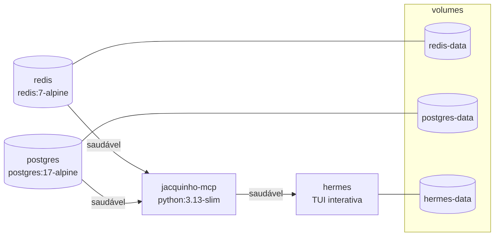
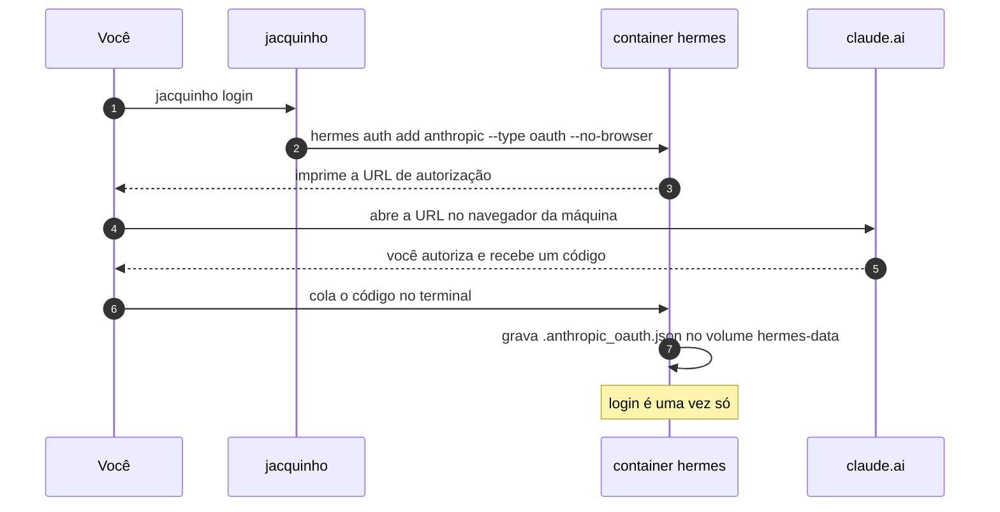

# Operação


## Serviços



A ordem de subida é imposta por condições de saúde: o agente não inicia até o
servidor MCP estar saudável, e o servidor MCP não inicia até o Redis e o
Postgres estarem.

| Serviço | Imagem | Papel |
|---|---|---|
| `redis` | `redis:7-alpine` | Janela de conversa e tickets de julgamento |
| `postgres` | `postgres:17-alpine` | Os registros dela: cozinha, receitas, orçamento, cardápio |
| `jacquinho-mcp` | construída aqui | Os onze servidores MCP |
| `hermes` | imagem publicada do agente | O chat interativo |

O agente sobe com `run`, não com `up`: o comando padrão dele é uma interface de
terminal interativa e precisa de TTY.

---

## O CLI

```bash
./bin/jacquinho install
```

Cria o link em `~/.local/bin` e avisa se esse diretório não estiver no `PATH`.
O script resolve o repositório através do próprio link simbólico, então
funciona de qualquer diretório.

| Comando | Efeito |
|---|---|
| `jacquinho` | Sobe os serviços, espera a saúde, abre o chat |
| `jacquinho up` | Só os serviços de fundo |
| `jacquinho status` | Tabela de serviços com saúde |
| `jacquinho tools` | Inventário de ferramentas agrupado por servidor |
| `jacquinho logs [svc]` | Acompanha os logs |
| `jacquinho confidence` | Acompanha a confiança do que o agente vai dizer |
| `jacquinho down` | Para tudo, preservando o estado |
| `jacquinho reset` | Para e apaga todo o estado, exigindo digitar `RESET` |
| `jacquinho hermes …` | Repassa argumentos ao CLI do agente |
| `jacquinho install` | Cria o link em `~/.local/bin` |

Todo start reconstrói a imagem do MCP. São cerca de cinco segundos com cache
quente, e em troca uma edição em `app/` nunca fica rodando contra uma imagem
antiga, que é uma falha sem nenhum sinal.

**A primeira execução é diferente**, e mostra a construção na tela. Ela baixa o
`python:3.13-slim` e instala as dependências, o que leva alguns minutos numa rede
comum. Nas seguintes o build volta a ser silencioso, porque com cache quente não
há o que dizer.

### Windows

O `bin/jacquinho` é um script bash e não roda em PowerShell nem no `cmd`. O
caminho suportado é **WSL2 com o Docker Desktop no backend WSL**, onde tudo
funciona como no Linux, inclusive o `jacquinho login`: ele já usa `--no-browser`
e imprime a URL para você colar no navegador do Windows.

Duas armadilhas que valem saber antes de culpar o programa:

**O repositório precisa estar dentro do sistema de arquivos do WSL**, em
`~/jacquinho` e não em `/mnt/c/...`. O caminho `/mnt/c` atravessa uma ponte entre
sistemas de arquivos, e o build, que copia o contexto inteiro e instala pacotes,
fica de dez a vinte vezes mais lento ali. É a diferença entre alguns minutos e
uma tarde.

**No Git Bash e no MSYS2 duas coisas quebram.** O chat, porque o Hermes sobe uma
interface interativa e o MinTTY não é um console do Windows, então o Docker
responde `the input device is not a TTY`; o contorno é prefixar com `winpty`. E o
`jacquinho reset`, porque o MSYS traduz o caminho `/d` do contêiner para um
caminho do Windows antes de o Docker ver; o contorno é `MSYS_NO_PATHCONV=1`. Os
dois contornos funcionam, e nenhum é necessário no WSL2.

Os contêineres em si são indiferentes ao host: `redis:7-alpine`,
`postgres:17-alpine`, a imagem do MCP e a do agente são todas Linux. Os hooks de
fronteira de turno rodam **dentro** do contêiner do Hermes, então o shell da sua
máquina não os alcança.

O `reset` apaga três coisas:

| Onde | O que sai |
|---|---|
| Postgres | Perfil da cozinha, catálogo de receitas com seus bloqueios, exigências, aceites e avaliações, lançamentos do orçamento, cardápio, feedback |
| Redis | Janela de conversa e resumo, fichas de julgamento |
| `state.db` do Hermes | Sessões, mensagens e prompts de sistema, mais o cache de páginas web |

A planilha não é tocada: ela é a origem da despensa, e depois de um `reset` o
Postgres é semeado de novo a partir dela, com as mesmas 37 linhas.

O **`auth.json` do agente sobrevive**, e é por isso que o `reset` mexe nas
linhas do `state.db` em vez de apagar o volume inteiro: o token de OAuth mora ao
lado da transcrição. Zerar uma consultoria não deveria custar um novo login no
navegador. Por outro lado, apagar só o Redis e o Postgres deixava o Hermes
reabrindo a conversa antiga em cima de bancos vazios, que é o pior dos dois
mundos: o agente lembra do que ela disse, e o registro não.

Para apagar tudo mesmo, incluindo a credencial:
`docker compose -f dockerfile/docker-compose.yaml down -v`.

Para conferir que o zero é zero:

```bash
docker compose -f dockerfile/docker-compose.yaml exec -T redis redis-cli DBSIZE
docker compose -f dockerfile/docker-compose.yaml exec -T postgres \
    psql -U jacquinho -d jacquinho \
    -c 'select relname, n_live_tup from pg_stat_user_tables order by relname'
```

Tudo em zero, menos `pantry_items` em 37.

---

## Credenciais

O agente precisa de credenciais de um provedor. Qual deles é escolha livre e não
muda mais nada: os servidores MCP, as ferramentas e todas as regras se comportam
de forma idêntica por baixo.

O eixo que importa aqui não é inteligência bruta, e sim **confiabilidade de
chamada de ferramenta**. São 59 ferramentas e cadeias de vários passos; um
modelo que não segura um esquema de ferramenta falha aqui independentemente do
tamanho.

| Caminho | Custo | Como | Onde fica |
|---|---|---|---|
| Assinatura Claude | já paga | `jacquinho login` | Token no volume `hermes-data` |
| Chave de API | por token | Chave em `dockerfile/.env` | O arquivo de ambiente |
| Camada gratuita | grátis, exige conta | Chave em `.env` + bloco no `hermes-config.yaml` | O arquivo de ambiente |
| Servidor local | grátis, sem conta | `provider: custom` apontando para `host.docker.internal` | Nada a guardar |

### Assinatura em vez de chave

**Este projeto autentica com uma credencial de conta Anthropic no plano Pro.**
Não há chave de API envolvida: o plano Pro não emite uma. O Hermes autentica por
OAuth contra a mesma conta que você usa no `claude.ai`, e a própria tela dele
rotula o fluxo como *Claude Pro/Max Authorization*.



#### Passo a passo

```bash
cd /caminho/para/o/projeto
./bin/jacquinho install
jacquinho login
```

O comando sobe os serviços e imprime uma caixa com um link:

```
╭─ Claude Pro/Max Authorization ────────────────────╮
│  Open this link in your browser:                  │
╰───────────────────────────────────────────────────╯

  https://claude.ai/oauth/authorize?code=true&client_id=…&scope=…
```

1. Abra o link no navegador desta máquina e autorize.
2. A Anthropic mostra um código. Copie.
3. Cole o código no terminal, onde o comando está esperando.

Os escopos pedidos são `user:profile`, `user:inference` e `org:create_api_key`.
O token fica em `.anthropic_oauth.json` dentro do volume `hermes-data`, não no
arquivo de ambiente, e nada de longa duração é escrito em `.env`.

#### Por que `--no-browser`

Não existe navegador dentro do container. Com essa opção o fluxo imprime a URL
em vez de tentar abrir uma janela, e você faz o passo do navegador na máquina.
O `jacquinho login` já passa a opção.

#### Confirmando

```bash
jacquinho hermes auth status    # a credencial ficou gravada?
jacquinho hermes model          # que modelos a assinatura oferece
jacquinho tools                 # as 59 ferramentas respondem?
jacquinho                       # abre o chat
```

Vale rodar `jacquinho hermes model` **antes** da primeira conversa. O modelo
padrão no `hermes-config.yaml` é `claude-sonnet-5`. O conjunto que uma assinatura
libera pode ser diferente do que uma chave de API alcança; se ele não estiver
lá, troque a linha `default:` pelo que aparecer. Nada mais muda: os onze
servidores MCP e as 59 ferramentas se comportam de forma idêntica por baixo.

### Modelo local

O compose mapeia a máquina hospedeira como `host.docker.internal`, então um
Ollama rodando nela é alcançável sem editar nada:

```yaml
model:
  default: 'qwen3:8b'
  provider: 'custom'
  base_url: 'http://host.docker.internal:11434/v1'
```

Duas ressalvas honestas. Sem GPU dedicada a inferência roda na CPU, e cada turno
passa a levar dezenas de segundos, e uma consultoria com muitas chamadas de
ferramenta fica longa. E modelos pequenos variam muito em uso de ferramenta:
escolha um treinado para *function calling* e teste com `jacquinho tools` antes
de contar com ele numa demonstração.

O modelo e o provedor estão fixados em `dockerfile/hermes-config.yaml`, que traz
um bloco pronto para cada caminho. O padrão é **Claude Sonnet 5**. O agente faz
muitas chamadas de ferramenta por turno e quase nenhuma pede raciocínio
profundo, mas são 59 ferramentas e cadeias de vários passos, e é condução, não
profundidade, que separa um turno bom de um turno perdido. `claude-haiku-4-5`
continua sendo uma linha, se custo pesar mais.

O servidor MCP não precisa de credencial de modelo nenhuma. Ele pode ser
iniciado, exercitado e depurado sem nenhuma presente.

---

## Observando a confiança ao vivo

O servidor pontua a própria trilha de evidências depois de cada chamada de
ferramenta e escreve uma linha por avaliação. Em um segundo terminal:

```bash
jacquinho confidence
```

```
após pantry_list_ingredients       1.00  〔o que ela tem: confiança alta · lido da planilha dela〕
após dishes_discover_dishes        1.00  〔sugestão de prato: confiança alta · consenso forte entre fontes〕
após kitchen_check_feasibility     0.30  〔se ela consegue fazer: confiança baixa, 1 impedimento(s)〕
     ! O gate de viabilidade não aprovou: não apresente o prato como decidido.
     kitchen_read_kitchen_profile       0.30
após pricing_calculate_cmv         0.64  〔custo: confiança média, 1 impedimento(s)〕
após pricing_price_scenarios       0.00  〔preço: confiança baixa, 3 impedimento(s)〕
     ! Sem preço de mercado observado: só o preço mínimo pode ser dito.
```

A nota é **da afirmação**, não do pipeline. O badge abre dizendo do que a
mensagem trata, e só a evidência daquele tipo entra na conta: ler a despensa dá
1,00 porque a planilha é determinística, enquanto falar de preço sem apurar
mercado dá 0,00. Pontuar tudo contra os cinco sinais daria zero nos dois casos.

Linhas apagadas são chamadas que não mexeram na evidência. Elas existem de
propósito: um observador mudo enquanto o agente trabalha parece quebrado.

A nota vai de 0 a 1: banda alta a partir de 0,75, média a partir de 0,50.

Isso não depende de o agente chamar nada. O middleware está no caminho de toda
ferramenta, e as que carregam evidência (o gate, o CMV, o consenso, o mercado e
a inflação) alimentam a nota. As linhas cruas saem em `jacquinho logs
jacquinho-mcp` com o prefixo `jacquinho.confidence`, em JSON.

### As três linhas que valem grep

Todas em `jacquinho logs jacquinho-mcp`, todas em JSON, e nenhuma depende de o
agente pedir.

| Prefixo | Quando aparece | O que dizer sobre ela |
|---|---|---|
| `jacquinho.confidence` | Toda chamada de ferramenta | Uma por chamada; a nota e a banda do que está prestes a ser dito |
| `jacquinho.claims` | Fim de turno, se a mensagem afirma algo conferível | A nota da mensagem, quantas afirmações foram conferidas, e quantas contradizem o que ela já ouviu |
| `jacquinho.verdict` | Fim de turno, se um prato morreu ou voltou | `delivered: false` significa que ela **não** foi informada e o próximo turno começa fechado |
| `jacquinho.figures` | Fim de turno, só se houver cifra sem lastro | Um R$ na mensagem que nenhuma ferramenta produziu, com o trecho onde aparece |
| `jacquinho.pacing` | Fim de turno, só se saiu uma parede | Quantas partes a mensagem tinha, que assuntos empilhou e por quê. Telemetria, não portão: o portão é `message_pacing`, no rascunho |

Turno limpo não gera as duas últimas. Se aparecerem, aponte para a mensagem:

```bash
jacquinho logs jacquinho-mcp | grep 'jacquinho.figures'
jacquinho logs jacquinho-mcp | grep 'jacquinho.verdict' | grep 'false'
```

A primeira pega o número que o modelo escreveu em prosa; a segunda, o veredito
que ele guardou para si. As duas nascem no mesmo lugar, a fronteira do turno,
que é o único ponto onde o servidor vê a mensagem que chega até ela.

---

## Depurando sem o agente

O servidor MCP é um serviço HTTP comum. Descomente o bloco `ports:` no arquivo
de compose para alcançá-lo da máquina, ou rode um cliente dentro da rede:

```bash
docker compose -f dockerfile/docker-compose.yaml \
  run --rm --no-deps -T jacquinho-mcp python -c "
import asyncio
from fastmcp import Client

async def main():
    async with Client('http://jacquinho-mcp:8000/mcp') as client:
        result = await client.call_tool('pantry_list_ingredients', {})
        print(result.data['total_ingredients'])

asyncio.run(main())
"
```

Esse é o jeito mais rápido de reproduzir o comportamento de uma ferramenta, e
não exige credencial nenhuma.

O estado da consultoria também é inspecionável direto, sem subir modelo:

```bash
docker exec jacquinho-postgres psql -U jacquinho -d jacquinho -c "
  SELECT r.dish, b.reason, b.blocking_item, b.lifted_because
    FROM recipes r JOIN recipe_blocks b ON b.recipe_slug = r.slug
   ORDER BY b.created_at;"
```

Por que um prato saiu, o que o trouxe de volta, quanto do orçamento foi para
quê, tudo com data e motivo.

O estoque dela também, com o histórico de para onde a carne foi:

```bash
docker exec jacquinho-postgres psql -U jacquinho -d jacquinho -c "
  SELECT i.ingredient,
         i.stock_quantity          AS semeado,
         COALESCE(sum(u.quantity), 0) AS ja_usado,
         i.stock_quantity - COALESCE(sum(u.quantity), 0) AS sobra
    FROM pantry_items i
    LEFT JOIN pantry_usage u ON u.ingredient_key = i.ingredient_key
   GROUP BY i.ingredient, i.stock_quantity
  HAVING COALESCE(sum(u.quantity), 0) > 0;"
```

E é aqui que se **muda** esse dado, que é uma das razões práticas de o estoque
morar no Postgres: repor o que ela comprou é um `UPDATE` de uma linha, e montar
um cenário de demonstração é outro. O consumo é só-adição: para devolver o que
um prato levou, apague as linhas dele, que é exatamente o que
`menu_remove_dish` e `pricing_reopen_recipe` fazem.

```bash
# ela comprou mais meio quilo de patinho
docker exec jacquinho-postgres psql -U jacquinho -d jacquinho -c "
  UPDATE pantry_items SET stock_quantity = stock_quantity + 0.5
   WHERE ingredient_key = 'carne moida patinho';"
```

### Configuração do agente

A configuração do agente declara a versão de esquema contra a qual foi escrita.
Uma configuração sem essa versão é lida como antiga e recusada, o que deixaria a
conexão MCP sem efeito enquanto tudo parece iniciar normalmente. Se faltarem
ferramentas no agente, procure primeiro por um aviso de migração de configuração
na saída de inicialização.

O modelo é declarado com o identificador puro, sem prefixo de fornecedor. Um
apelido no formato `fornecedor/modelo` pertence a agregadores, e o provedor
direto o recusa. `jacquinho hermes doctor` verifica os dois pontos.

---

## Modos de falha

| Sintoma | Causa | O que fazer |
|---|---|---|
| O MCP nunca fica saudável | Planilha ausente ou malformada | `jacquinho logs jacquinho-mcp` |
| Operações reportam indisponibilidade | Redis ou Postgres inalcançável | `jacquinho status` |
| Os preços voltam vazios | Janela de recência apertada demais | Alargue a janela e rotule a referência como mais antiga |
| Lucro reportado como só nominal | Fonte do indicador inalcançável | Diga isso; não substitua por uma taxa inventada |
| A busca devolve erro | Provedor inalcançável ou limitado | Configure um provedor com chave, ou pergunte a ela o que já cozinha |
| O agente sobe sem ferramentas | Configuração recusada na inicialização | Procure o aviso de migração |

Todos degradam para uma lacuna declarada. Nenhum degrada para um palpite.

---

## O que não está na imagem

A planilha é montada somente para leitura e nunca copiada para uma camada. A
configuração do agente e o arquivo de ambiente são montados. O estado vive em
volumes nomeados. Uma imagem pode, portanto, ser reconstruída ou substituída sem
tocar em nada que pertença à Dona Maria.
